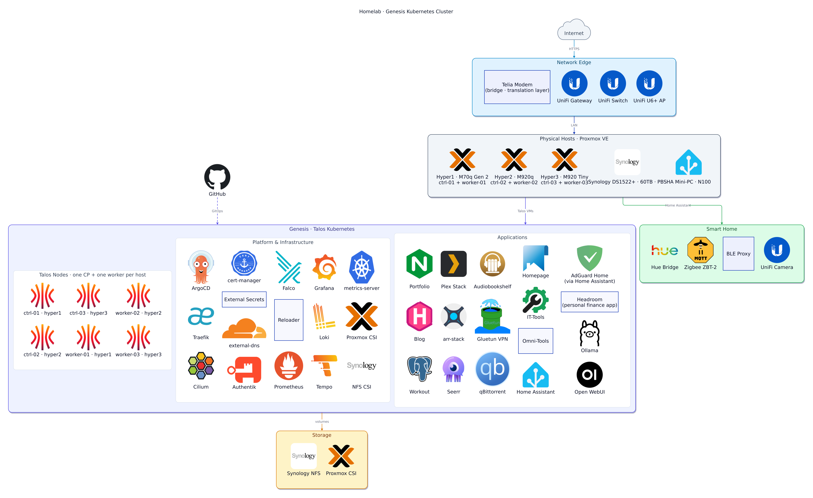

<div align="center">

# 🌿 Eden

### Homelab Infrastructure

[](https://kubernetes.io) [](https://www.talos.dev) [](https://argoproj.github.io/cd/) [](https://www.terraform.io)

[](https://github.com/mortennordbye/homelab/actions/workflows/build-blog.yaml) [](https://github.com/mortennordbye/homelab/actions/workflows/build-portfolio.yaml) [](https://github.com/mortennordbye/homelab/actions/workflows/container-vulnerability-scan.yaml)

[](LICENSE) [](https://github.com/mortennordbye/homelab/commits/main) [](https://github.com/mortennordbye/homelab/issues) [](https://github.com/mortennordbye/homelab/stargazers)

My personal lab environment for experimenting with infrastructure and hosting self-hosted services. Professionally, I work with these technologies daily, but the homelab gives me freedom to explore ideas and patterns that don't always fit production constraints. This is where curiosity meets practicality, testing new tools, solving real problems at home, and yes, occasionally breaking things in the pursuit of learning.

The repository is public by design. Transparency keeps me honest about following best practices, even when it's just for fun.

</div>

## Quick Links

[](https://nordbye.it) [](https://blog.nordbye.it) [](https://www.linkedin.com/in/morten-victor-nordbye/) [](https://github.com/mortennordbye)

Feel free to send me a DM, open a pull request, or steal code from here. The goal is to learn and make connections.

---

## Homelab Overview

[](docs/diagrams/homelab-overview.png?raw=1)

> **Click to open the full-size image.** A map of the whole homelab — how the hardware, cluster and services fit together. Auto-generated through the [pipeline](.github/workflows/render-diagram.yaml) from [this file](docs/diagrams/homelab-overview.d2).

---

## Network & Service Flow

[](docs/diagrams/network-flow.png?raw=1)

> **Click to open the full-size image.** Shows which services talk to each other and how traffic flows through the cluster. Auto-generated through the [pipeline](.github/workflows/render-diagram.yaml) from [this file](docs/diagrams/network-flow.d2).

---

## Repository Structure

> **Note:** This is a simplified view showing the main folders and key files. The actual repository contains additional directories and configurations.

```
homelab
├── k8s/talos/
│   ├── apps/                            # Application deployments
│   │   ├── arr-stack/
│   │   ├── blog/
│   │   └── plex-media-stack/
│   └── infra/                           # Infrastructure components
│       ├── argocd/
│       ├── cilium/
│       └── traefik/
├── terraform/
│   ├── azure/
│   │   └── state/                       # Remote state backend
│   └── proxmox/                         # Proxmox cluster IaC
│       └── hyper-cluster/
│           └── k8s/
├── blog/                                # Hugo blog source
│   ├── Dockerfile
│   ├── config/
│   ├── content/
│   └── themes/
├── portfolio/                           # Portfolio site source
│   ├── Dockerfile
│   ├── nginx/
│   └── src/
└── ai/                                  # AI agents, skills, projects, local LLM
    ├── agents/
    ├── skills/
    ├── projects/
    ├── local-llm/
    ├── prompts/
    └── notes/
```

---

## Kubernetes Tech Stack

| Category      | Components                                                                                                                                                                             |
| ------------- | -------------------------------------------------------------------------------------------------------------------------------------------------------------------------------------- |
| GitOps        | [ArgoCD](https://argoproj.github.io/cd/)                                                                                                                                               |
| Networking    | [Cilium](https://cilium.io/) (CNI + eBPF), [Traefik](https://traefik.io/) ([Gateway API](https://gateway-api.sigs.k8s.io/))                                                            |
| Security      | [Falco](https://falco.org/) (runtime security), [Authentik](https://goauthentik.io/) (SSO), [Cert-manager](https://cert-manager.io/), [External Secrets Operator](https://external-secrets.io/)                                                                                    |
| Observability | [Prometheus](https://prometheus.io/), [Grafana](https://grafana.com/), [Loki](https://grafana.com/oss/loki/) (logs), [Tempo](https://grafana.com/oss/tempo/) (traces), [OpenTelemetry](https://opentelemetry.io/), [Metrics-server](https://github.com/kubernetes-sigs/metrics-server) |
| Automation    | [Reloader](https://github.com/stakater/Reloader) (config/secret-triggered rollouts)                                                                                                   |
| Storage       | [Proxmox CSI](https://github.com/sergelogvinov/proxmox-csi-plugin), [Synology](https://www.synology.com/) (NFS)                                                                        |
| Platform      | [Proxmox VE](https://www.proxmox.com/) (6-node HA cluster), [Talos Linux](https://www.talos.dev/), [Terraform](https://www.terraform.io/)                                              |

---

## Security

### Container Vulnerability Scanning

Automated vulnerability scanning runs weekly and on every Dockerfile change using Trivy. Scans detect CRITICAL and HIGH severity vulnerabilities in both blog and portfolio containers, with results automatically uploaded to GitHub Security tab for tracking and remediation.

### Runtime Security

[Falco](https://falco.org/) runs as a DaemonSet on every node, detecting anomalous activity at the syscall level through a modern eBPF probe (the Talos-safe driver — no kernel module). Detections are routed to Discord via Falcosidekick, false positives are tuned out using the upstream rules' own template macros (keeping signal high), and Falco metrics feed a Grafana dashboard for at-a-glance security visibility.

---

## CI/CD Workflows

| Workflow                                                                                | Trigger                                   | Purpose                                                |
| --------------------------------------------------------------------------------------- | ----------------------------------------- | ------------------------------------------------------ |
| [**Build and Deploy Blog**](.github/workflows/build-blog.yaml)                          | Push to `main` (blog changes)                  | Builds Hugo blog, pushes to GHCR, updates k8s manifest |
| [**Build and Deploy Portfolio**](.github/workflows/build-portfolio.yaml)                | Push to `main` (stage); manual dispatch (prod) | Builds portfolio image, pushes to GHCR, deploys stage/prod |
| [**Container Vulnerability Scan**](.github/workflows/container-vulnerability-scan.yaml) | Weekly, Dockerfile changes, manual             | Scans blog & portfolio containers with Trivy           |
| [**Render Diagrams**](.github/workflows/render-diagram.yaml)                            | Push to `main` (`docs/diagrams/*.d2`), manual  | Renders D2 sources to SVG + PNG, commits the result    |
| [**K8s Update Reminder**](.github/workflows/30-days-k8s-update-reminder.yml)            | Monthly (1st)                                  | Discord notification for Kubernetes maintenance        |
| [**Server Update Reminder**](.github/workflows/30-days-server-update-reminder.yml)      | Monthly (15th)                                 | Discord notification for server updates                |

---

## Hardware

### Compute Nodes

| Node   | Model                         | CPU                                      | RAM   | Storage |
| ------ | ----------------------------- | ---------------------------------------- | ----- | ------- |
| Hyper1 | Lenovo ThinkCentre M70q Gen 2 | Intel Core i5-11400T (6C/12T @ 1.30 GHz) | 32 GB | 1 TB    |
| Hyper2 | Lenovo ThinkCentre M920q      | Intel Core i5-8500T (6C/6T @ 2.10 GHz)   | 32 GB | 1 TB    |
| Hyper3 | Lenovo ThinkCentre M920 Tiny  | Intel Core i7-8700T (6C/12T @ 2.40 GHz)  | 32 GB | 1 TB    |

#### Proxmox Setup Scripts

[Community Proxmox VE Helper-Scripts](https://community-scripts.github.io/ProxmoxVE/) run on each node after install:

| Script                                                                                                                     | Purpose                                                                  |
| -------------------------------------------------------------------------------------------------------------------------- | ------------------------------------------------------------------------ |
| [Post PVE Install](https://community-scripts.github.io/ProxmoxVE/scripts?id=post-pve-install)                              | Post-install tuning — repo sources, subscription nag, updates            |
| [NIC Offloading Fix](https://community-scripts.github.io/ProxmoxVE/scripts?id=nic-offloading-fix&category=Proxmox+%26+Virtualization) | Disables NIC hardware offloading to fix interface connectivity issues |

### Storage

| Device | Model            | Capacity        | Details                        |
| ------ | ---------------- | --------------- | ------------------------------ |
| NAS    | Synology DS1522+ | 3 × 20TB (60TB) | SHR, Btrfs, 2 × 1TB NVMe cache |

### Network Equipment

| Device       | Model               | Type           |
| ------------ | ------------------- | -------------- |
| Router       | UniFi Cloud Gateway | Gateway/Router |
| Switch       | UniFi Lite 8 PoE    | Managed Switch |
| Access Point | UniFi U6+           | WiFi 6 AP      |
| Modem        | Telia               | Cable Modem    |

### IoT & Smart Home

#### Home Assistant Server

| Component | Model                       | CPU        | RAM | Network         |
| --------- | --------------------------- | ---------- | --- | --------------- |
| Hardware  | Topton N100 Fanless Mini PC | Intel N100 | TBD | 4 × 2.5G i226-V |

#### Devices

| Device                  | Type               | Purpose                    |
| ----------------------- | ------------------ | -------------------------- |
| Philips Hue Bridge Pro  | Smart Lighting Hub | Lighting control           |
| Nabu Casa Connect ZBT-2 | Zigbee Coordinator | Zigbee device coordination |
| M5Stack Atom Lite       | Bluetooth Proxy    | Bluetooth range extension  |
| UniFi G6 Instant        | Security Camera    | Indoor surveillance        |

---

<div align="center">

### Star this repo if you find it useful

Made by [Morten Victor Nordbye](https://nordbye.it)

</div>
