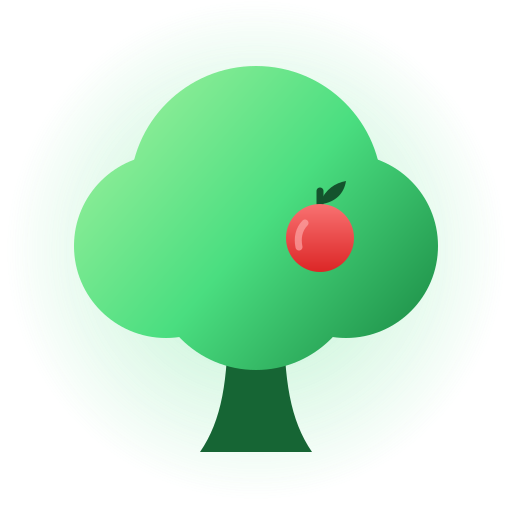

<div align="center">



# Eden

### Homelab Infrastructure

[](https://kubernetes.io) [](https://www.talos.dev) [](https://argoproj.github.io/cd/) [](https://www.terraform.io)

[](https://github.com/mortennordbye/homelab/actions/workflows/build-blog.yaml) [](https://github.com/mortennordbye/homelab/actions/workflows/build-portfolio.yaml) [](https://github.com/mortennordbye/homelab/actions/workflows/container-vulnerability-scan.yaml)

[](LICENSE) [](https://github.com/mortennordbye/homelab/commits/main) [](https://github.com/mortennordbye/homelab/issues) [](https://github.com/mortennordbye/homelab/stargazers)

My personal lab environment for experimenting with infrastructure and hosting self-hosted services. Professionally, I work with these technologies daily, but the homelab gives me freedom to explore ideas and patterns that don't always fit production constraints. This is where curiosity meets practicality, testing new tools, solving real problems at home, and yes, occasionally breaking things in the pursuit of learning.

The repository is public by design. Transparency keeps me honest about following best practices, even when it's just for fun.

<picture>
  <source media="(prefers-color-scheme: dark)" srcset="https://raw.githubusercontent.com/mortennordbye/homelab/status-data/status-dark.svg" />
  
</picture>

</div>

> Drawn every 15 minutes from [nordbye.it/api/v1/infra](https://nordbye.it/api/v1/infra), which a [CronJob](k8s/talos/apps/portfolio/status-publisher.yaml) fills from the Kubernetes API and Prometheus. When the cluster is unreachable the card says so.

---

## Quick Links

[](https://nordbye.it) [](https://blog.nordbye.it) [](https://www.linkedin.com/in/morten-victor-nordbye/) [](https://github.com/mortennordbye)

Feel free to send me a DM, open a pull request, or steal code from here. The goal is to learn and make connections.

---

## How It Works

Terraform builds the Talos VMs on Proxmox. Everything after that arrives through git.

```
push to main
   ├─ GitHub Actions builds portfolio and blog, pushes to GHCR
   │     └─ Kargo promotes stage to prod as a pull request you merge
   ├─ external app repos call bump-image.yml, which opens a PR pinning an immutable sha tag
   └─ Argo CD reconciles k8s/talos/** onto the cluster
         ├─ External Secrets fetches credentials at runtime, so none are committed
         ├─ Traefik publishes routes through Gateway API, cert-manager and external-dns handle TLS and DNS
         └─ KEDA lets idle apps drop to zero; the HTTP interceptor wakes them on the first request
```

Argo CD runs an app-of-apps. The two root Applications in `k8s/talos/infra/argocd/` own every other Application, so a new workload is a new directory.

---

## Homelab Overview

[](docs/diagrams/homelab-overview.png?raw=1)

> **Click to open the full-size image.** A map of the whole homelab — how the hardware, cluster and services fit together. Auto-generated through the [pipeline](.github/workflows/render-diagram.yaml) from [this file](docs/diagrams/homelab-overview.d2).

---

## Network & Service Flow

[](docs/diagrams/network-flow.png?raw=1)

> **Click to open the full-size image.** Shows which services talk to each other and how traffic flows through the cluster. Auto-generated through the [pipeline](.github/workflows/render-diagram.yaml) from [this file](docs/diagrams/network-flow.d2).

---

## Repository Structure

> **Note:** This is a simplified view showing the main folders and key files. The actual repository contains additional directories and configurations.

```
homelab
├── k8s/talos/
│   ├── apps/                            # Application deployments
│   │   ├── arr-stack/
│   │   ├── blog/
│   │   └── plex-media-stack/
│   └── infra/                           # Infrastructure components
│       ├── argocd/
│       ├── cilium/
│       └── traefik/
├── terraform/
│   ├── azure/
│   │   └── state/                       # Remote state backend
│   └── proxmox/                         # Proxmox cluster IaC
│       └── hyper-cluster/
│           └── k8s/
├── blog/                                # Hugo blog source
│   ├── Dockerfile
│   ├── config/
│   ├── content/
│   └── themes/
├── portfolio/                           # Portfolio site source
│   ├── Dockerfile
│   ├── nginx/
│   └── src/
└── ai/                                  # AI agents, skills, projects, local LLM
    ├── agents/
    ├── skills/
    ├── projects/
    ├── local-llm/
    ├── prompts/
    └── notes/
```

---

## Kubernetes Tech Stack

| Category | Components |
| --- | --- |
| GitOps | [Argo CD](https://argoproj.github.io/cd/) (app-of-apps), [Kargo](https://kargo.io/) (stage to prod promotion for blog, headroom, logeverylift, portfolio, reelsmith and verksted), [Argo Rollouts](https://argoproj.github.io/rollouts/) (installed, no workload uses it yet) |
| Networking | [Cilium](https://cilium.io/) (CNI, eBPF, L2 announcements and LB IPAM), [Traefik](https://traefik.io/) via [Gateway API](https://gateway-api.sigs.k8s.io/), [external-dns](https://github.com/kubernetes-sigs/external-dns) (Cloudflare) |
| Security | [Falco](https://falco.org/) (runtime, modern eBPF probe), [Authentik](https://goauthentik.io/) (SSO), [cert-manager](https://cert-manager.io/), [External Secrets Operator](https://external-secrets.io/) (Bitwarden Secrets Manager, [pattern](docs/secrets-management.md)) |
| Observability | [Prometheus and Alertmanager](https://prometheus.io/), [Grafana](https://grafana.com/), [Loki](https://grafana.com/oss/loki/) (logs), [Tempo](https://grafana.com/oss/tempo/) (traces), [OpenTelemetry Collector](https://opentelemetry.io/), [metrics-server](https://github.com/kubernetes-sigs/metrics-server) |
| Scaling | [KEDA](https://keda.sh/) with the [HTTP add-on](https://github.com/kedacore/http-add-on): nine apps drop to zero replicas and the interceptor wakes them on the first request |
| Automation | [Reloader](https://github.com/stakater/Reloader) (config and secret triggered rollouts) |
| Storage | [Proxmox CSI](https://github.com/sergelogvinov/proxmox-csi-plugin) (block), [csi-driver-nfs](https://github.com/kubernetes-csi/csi-driver-nfs) (Synology NFS) |
| Databases | [PostgreSQL 18](https://www.postgresql.org/) (in-cluster, NFS-backed, behind logeverylift) |
| Platform | [Proxmox VE](https://www.proxmox.com/) on three Lenovo nodes, [Talos Linux](https://www.talos.dev/) (three control plane and three worker VMs), [Terraform](https://www.terraform.io/) |

---

## Security

### Container Vulnerability Scanning

Automated vulnerability scanning runs weekly and on every Dockerfile change using Trivy. Scans detect CRITICAL and HIGH severity vulnerabilities in both blog and portfolio containers, with results automatically uploaded to GitHub Security tab for tracking and remediation.

### Runtime Security

[Falco](https://falco.org/) runs as a DaemonSet on every node, detecting anomalous activity at the syscall level through a modern eBPF probe (the Talos-safe driver — no kernel module). Detections are routed to Discord via Falcosidekick, false positives are tuned out using the upstream rules' own template macros (keeping signal high), and Falco metrics feed a Grafana dashboard for at-a-glance security visibility.

---

## CI/CD Workflows

| Workflow                                                                                | Trigger                                   | Purpose                                                |
| --------------------------------------------------------------------------------------- | ----------------------------------------- | ------------------------------------------------------ |
| [**Build and Deploy Blog**](.github/workflows/build-blog.yaml)                          | Push to `main` (blog changes)                  | Builds Hugo blog, pushes to GHCR, updates k8s manifest |
| [**Build and Deploy Portfolio**](.github/workflows/build-portfolio.yaml)                | Push to `main`                                 | Builds portfolio image and pushes to GHCR ([Kargo](https://kargo.io/) promotes stage → prod) |
| [**Bump Image Tag**](.github/workflows/bump-image.yml)                                  | Called by external app repos (`workflow_call`) | Opens a PR pinning an app to a new immutable `sha-` image tag ([pattern](docs/gitops-external-app-deploys.md)) |
| [**Container Vulnerability Scan**](.github/workflows/container-vulnerability-scan.yaml) | Sundays, Dockerfile changes, pull request, manual | Scans the blog and portfolio images with Trivy, CRITICAL and HIGH with a fix available |
| [**Render Diagrams**](.github/workflows/render-diagram.yaml)                            | Push to `main` (`docs/diagrams/*.d2`), manual  | Renders D2 sources to SVG + PNG, commits the result    |
| [**Reminders**](.github/workflows/reminders.yml)                                        | Monthly (1st, 8th, 15th), manual | Discord reminders for Kubernetes upkeep, backups, and server updates |
| [**Dependency Review**](.github/workflows/dependency-review.yml)                        | PR                                             | Blocks pull requests that add known-vulnerable dependencies |
| [**Scorecard**](.github/workflows/scorecard.yml)                                        | Push to `main`, Mondays 03:00 UTC | OpenSSF supply chain score, published to the Security tab |
| [**Status Card**](.github/workflows/status-card.yaml)                                   | Every 15 minutes, manual | Reads the cluster's status endpoint and redraws the card at the top of this page |
| [**Star History**](.github/workflows/star-history.yaml)                                 | Every 6 hours | Draws the star chart at the foot of this page from this repo's own stargazer data |
| [**CI Blog**](.github/workflows/ci-blog.yaml) · [**CI Portfolio**](.github/workflows/ci-portfolio.yaml) | Pull request                   | Pull request gates; pushes to `main` are gated inside the build workflows |
| [**Kargo Automerge**](.github/workflows/kargo-automerge.yaml)                           | Kargo promotion PR                             | Merges promotion PRs for the apps listed in `KARGO_AUTOMERGE_APPS`, where the canary is the real gate |
| [**Lighthouse**](.github/workflows/lighthouse.yaml)                                     | Mondays 06:00 UTC, manual | Audits the live public sites, median of 3 runs, gating SEO, accessibility and best practices |
| [**Render Logo**](.github/workflows/render-logo.yaml)                                   | Push to `main` (`docs/logo/source.jpg`)        | Re-crops the logo from its source and commits the result, so the image can't drift |

---

## Hardware

### Compute Nodes

| Node   | Model                         | CPU                                      | RAM   | Storage |
| ------ | ----------------------------- | ---------------------------------------- | ----- | ------- |
| Hyper1 | Lenovo ThinkCentre M70q Gen 2 | Intel Core i5-11400T (6C/12T @ 1.30 GHz) | 32 GB | 1 TB    |
| Hyper2 | Lenovo ThinkCentre M920q      | Intel Core i5-8500T (6C/6T @ 2.10 GHz)   | 32 GB | 1 TB    |
| Hyper3 | Lenovo ThinkCentre M920 Tiny  | Intel Core i7-8700T (6C/12T @ 2.40 GHz)  | 32 GB | 1 TB    |

#### Proxmox Setup Scripts

[Community Proxmox VE Helper-Scripts](https://community-scripts.github.io/ProxmoxVE/) run on each node after install:

| Script                                                                                                                     | Purpose                                                                  |
| -------------------------------------------------------------------------------------------------------------------------- | ------------------------------------------------------------------------ |
| [Post PVE Install](https://community-scripts.github.io/ProxmoxVE/scripts?id=post-pve-install)                              | Post-install tuning — repo sources, subscription nag, updates            |
| [NIC Offloading Fix](https://community-scripts.github.io/ProxmoxVE/scripts?id=nic-offloading-fix&category=Proxmox+%26+Virtualization) | Disables NIC hardware offloading to fix interface connectivity issues |

### Storage

| Device | Model            | CPU                            | RAM  | Capacity         | Details                                                                              |
| ------ | ---------------- | ------------------------------ | ---- | ---------------- | ------------------------------------------------------------------------------------ |
| NAS    | Synology DS1522+ | AMD Ryzen R1600 (2C @ 2.6 GHz) | 8 GB | 3 × 20TB (60TB)  | SHR, Btrfs, 2 × 1TB NVMe cache · DSM 7.3.2 · hosts a Proxmox Backup Server (PBS) VM   |

### Network Equipment

| Device       | Model               | Type           |
| ------------ | ------------------- | -------------- |
| Router       | UniFi Cloud Gateway | Gateway/Router |
| Switch       | UniFi Lite 8 PoE    | Managed Switch |
| Access Point | UniFi U6+           | WiFi 6 AP      |
| Modem        | Telia               | Cable Modem    |

### IoT & Smart Home

#### Home Assistant Server

| Component | Model                       | CPU        | RAM | Storage    | OS                 | Network         |
| --------- | --------------------------- | ---------- | --- | ---------- | ------------------ | --------------- |
| Hardware  | Topton N100 Fanless Mini PC | Intel N100 | TBD | 512 GB SSD | Home Assistant OS  | 4 × 2.5G i226-V |

#### Devices

| Device                  | Type               | Purpose                    |
| ----------------------- | ------------------ | -------------------------- |
| Philips Hue Bridge Pro  | Smart Lighting Hub | Lighting control           |
| Nabu Casa Connect ZBT-2 | Zigbee Coordinator | Zigbee device coordination |
| M5Stack Atom Lite       | Bluetooth Proxy    | Bluetooth range extension  |
| UniFi G6 Instant        | Security Camera    | Indoor surveillance        |

---

## Other Projects

A few other things I build and self-host outside this repo:

| Project | Description | Stack |
| ------- | ----------- | ----- |
| [**logeverylift**](https://github.com/mortennordbye/logeverylift) | Mobile-first workout tracking PWA | Next.js 16, PostgreSQL 18, Drizzle |
| [**lawless-waf**](https://github.com/mortennordbye/lawless-waf) | Tune Azure WAF false positives without paying Log Analytics prices | Python, React, Terraform |
| [**headroom**](https://github.com/mortennordbye/headroom) | Self-hosted personal finance tracker for budgets, assets, investments, and loan modeling | TypeScript, SQLite, Docker |

---

<div align="center">

### Star this repo if it is useful to you

<a href="https://github.com/mortennordbye/homelab/stargazers">
  <picture>
    <source media="(prefers-color-scheme: dark)" srcset="https://raw.githubusercontent.com/mortennordbye/homelab/stars-data/stars-dark.svg" />
    
  </picture>
</a>

Made by [Morten Victor Nordbye](https://nordbye.it)

</div>
