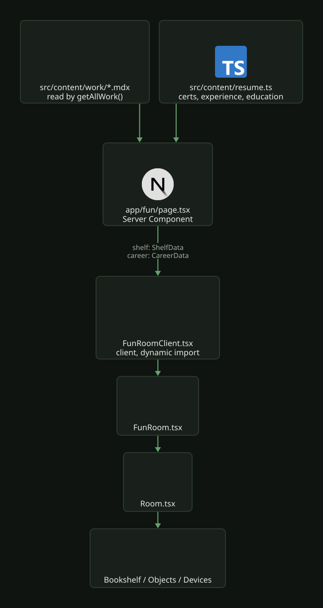

# The fun room

`/fun` is a first-person 3D flat that is the portfolio: every section of the site appears as an
object you can walk up to, look at and press `E` on.

The plan is the real apartment, 6.3 x 6.1m, with all four spaces walkable: stue/kjøkken,
soverom, bad and entré. `flat.ts` holds the plan, and both the wall meshes and the collision
boxes are built from that one list, so a wall you can walk through cannot happen by editing one
and forgetting the other. The flat is rebuilt on the site's palette rather than its real colours
(`docs/apps/portfolio/brand/decisions.md`: the ground is warm near-black, the joinery dark oak, green
only ever a lit point).

It lives in `portfolio/`, is dynamic-imported with `ssr: false`, and never becomes the only path
to anything: every section it exposes stays reachable through normal navigation. That is what
lets it skip carrying SEO and accessibility on its own, and why `fun` sits beside the other nav
entries rather than replacing them.

Movement is free by default: first person, WASD, mouse look, pointer lock, collision, head bob
scaled to actual speed. A room you are shown is a diagram with extra steps.

`/infrastructure` stays separate and untouched. That page's premise is that its claims are
checkable, which a 3D room fights with. A page labelled "fun" is honest by construction.

Two files outside the feature directories carry room state: `compose.yaml` sets the
`STATUS_FILE` dev env, and `src/app/globals.css` holds the `fun-immersive` body class that hides
the site header and footer while the room is mounted.

---

## Running it

No native node. Everything is Docker-wrapped through the Makefile in `portfolio/`.

```bash
cd portfolio
make build          # start the dev stack → http://localhost:3000
make typecheck      # tsc --noEmit
make lint           # eslint
make clean          # tear down, including named volumes
```

Three Docker traps:

`/app/public` is the read-only `cv-bundle` named volume, not the bind mount (`compose.yaml` says
so in a comment). Anything new under `public/` (models, textures, icons) 404s until you run
`make clean && make build`, because the volume is filled once by a one-shot service copying out
of the image.

Turbopack's persistence cache is also a named volume (`next-cache`). After renaming a route or
component directory you can get a 404 on every route while the files are plainly present in both
host and container. `make clean && make build` fixes it; a plain `make build` does not.

The macOS bind mount can hand Turbopack a truncated copy of a file mid-write, producing a syntax
error at a line that is fine on disk. `touch` the file and reload.

---

## File map

All under `portfolio/src/`.

| File | Responsibility |
|---|---|
| `app/fun/page.tsx` | Server component. Reads case studies, certs and career from disk and passes them down. |
| `app/fun/FunRoomClient.tsx` | Thin client wrapper: `next/dynamic` with `ssr:false` is illegal in a Server Component. |
| `components/fun/FunRoom.tsx` | The root: scene composition, lighting, post-processing, HUD, all card state, the loading flow. |
| `components/fun/Room.tsx` | Room shell and furniture: walls, floor, desk, door, lantern, sideboard placement, object placement. Also owns `DESK_SCREEN` / `DESK_TERMINAL` / `CHAIR_Z`, because the stands and the collision boxes have to agree with them. |
| `components/fun/flat.ts` | The floor plan: zones, wall runs with door openings, and the plan-to-world helpers (`at`, `px`, `pz`). Placements are written in plan metres so they can be checked against the drawing. |
| `components/fun/Furniture.tsx` | Sofa and television; the wood stove, the small corner table and its chairs; the kitchen; the bedroom (bed, mirrored wardrobe, over-bed units, fan, poster, blind); the bathroom. |
| `components/fun/Hallway.tsx` | The entré: coat run, shoe rack, and the tall cabinet (`CABINET`) that holds the case studies. |
| `components/fun/Contents.tsx` | What stands inside cupboards, drawers and the fridge, as two instanced meshes. |
| `components/fun/openable.tsx` | Shared motion for doors, drawers and fronts. |
| `components/fun/Outside.tsx` | The view beyond the windows, built as real geometry for parallax and left unlit. |
| `components/fun/Devices.tsx` | Homelab hardware models, the sideboard, and `HouseDevices`: the smart-home kit placed around the flat. |
| `components/fun/Cctv.tsx` | Looking through the security camera on the TV bench: the lens's render and the feed's overlay. |
| `content/hardware.ts` | Hardware names and specs, transcribed from the repo README. `DEVICES` is shared with `/infrastructure`; `HOUSE` is the room's own. Every entry must have a README row. |
| `components/fun/Bookshelf.tsx` | Case studies as books (`ShelvedBooks`), laid out into the hall cabinet's bays from array length. |
| `components/fun/WallCertificates.tsx` | Certificates standing on wall boards by the desk. |
| `components/fun/Objects.tsx` | The note on the fridge door, contact card, gym bag, career album, service leaflets. Nothing in here hangs on a wall; see the file header. |
| `components/fun/Abacus.tsx` | The skills, counted on an abacus on the dining table. |
| `components/fun/PrintedPosts.tsx` | The newest blog covers, framed together on the wall. Lays itself out from `/api/v1/blog`. |
| `components/fun/Printer.tsx` | The CV printer: a screen on the lid toggles the CV customizer's flags, and printing downloads the matching PDF while a sheet carrying its page one (`preview` in `cv-manifest.json`, rendered by Ghostscript in the Dockerfile's `pdfbuild` stage) feeds out. |
| `components/fun/Touch.tsx` | Phone controls. `TouchLook` (inside the Canvas and inside `InteractionProvider`) does drag-to-look and tap-to-activate; `TouchStick` is the DOM walk stick. |
| `components/fun/Sonos.tsx` | The speaker on the sideboard and the Web Audio rickroll it plays. No audio files: melody and drum kit are synthesised. |
| `components/fun/Sleep.tsx`, `components/fun/Visitor.tsx` | Lying down on the bed, and who turns up if you stay there after the alarm. |
| `components/fun/Terminal.tsx` | The shell on the portrait desk monitor. |
| `components/fun/Desktop.tsx` | The landscape desk monitor as a GNOME-style desktop: Files, a browser with mock Argo CD and Grafana, Room controls, a text editor with real source from this repo, Mines and Snake. |
| `components/fun/Screen.tsx` | Monitor mesh and DOM panel mount. `Screen` is one panel; `Dashboard` is the television carrying six at once; `PanelCard` is the chrome both share. |
| `components/fun/Panels.tsx` | Content of the live infra panels. Authored at one size (640x376); the television scales them down, so there is no second "small" variant to keep in step. |
| `components/fun/feed.ts` | `/api/v1/infra` polling and staleness rules, and `useRepos`. |
| `components/fun/interaction.tsx` | Look-at-and-press: raycast registry, `Interactive` wrapper. |
| `components/fun/StaticMerge.tsx` | Wraps `Room`: after mount, draws the static meshes as one mesh per material and hides the originals. `NO_MERGE` is the opt-out. |
| `components/fun/Hud.tsx` | Aiming dot, look-at prompt, keybinds, `InfoPanel` sheet. |
| `components/fun/LeaderLabel.tsx`, `components/fun/Marker.tsx` | The house annotation device the prompts are built from, and its brass marker. |
| `components/fun/RoomIntro.tsx`, `components/fun/RoomLoading.tsx` | The desktop intro card and the loading screen, sharing one poster backdrop. |
| `components/fun/FirstPerson.tsx` | WASD, collision (`BLOCKERS`), head bob. Writes the camera position every frame it is enabled, `y` included: anything else that moves the camera has to switch it off first. |
| `components/fun/props.tsx` | Scanned glTF prop loader (`Prop`). |
| `components/fun/shelf.ts` | Shared data types for shelf and career. |
| `components/materials/surface.ts` | PBR surface loader (`useSurface`), shared with the shelf and the bench. |
| `components/materials/paper.ts` | `PAPER` stock and ink ramp, so every printed surface in the room is the same sheet. |
| `components/materials/StudyEnvironment.tsx` | The site's IBL. Shared with the shelf, the bench and the resume object. |
| `components/materials/oak.ts` | `OAK` tints, so every oak surface on the site is the same plank. |

Assets: `public/textures/shelf/` (shared with the home page), `public/textures/fun/`,
`public/models/fun/` (meshopt geometry and WebP maps), `public/icons/social/`. Surfaces and
models are CC0 from Poly Haven, credited bottom-right inside the room. No HDRI ships:
`StudyEnvironment` builds the probe from two `Lightformer`s at no byte cost. Measure the cold
`/fun` payload against `make run-prod` on a port the browser has never seen, never the dev server
and never a port that served an older build.

---

## How data reaches the room

The page is a Server Component so it can read content off disk, then hands plain data to the
client: `ShelfData` built from `getAllWork()` and `CareerData` from `resume.ts`. There is no API route for room content and there should not be one.

[](../../assets/diagrams/portfolio-fun-room-data.svg)

Live data is different. `feed.ts` polls `/api/v1/infra` every 60s with the same snapshot and
staleness rules as `LiveStatus` on `/infrastructure`, and holds `useRepos`, which the
desktop's Files app reads. `PrintedPosts` fetches `/api/v1/blog` once when the room loads, because the covers have to
be up before anybody walks up to the wall.

Locally `compose.yaml` sets `STATUS_FILE=/app/dev/status.json` so `/api/v1/infra` takes the same
code path as the cluster against the fixture in `portfolio/dev/status.json`. Keep the fixture's
shape identical to the publisher's: a fixture with a different shape makes panels look right
locally and break in production. Every field stays optional regardless: a missed publish has to
degrade, not throw.

The status payload's top-level `apps` is not the room's application list. It is the KEDA sleeper
rollup, an object. The per-application rows are at `gitops.applications.list`, certificates at
`security.certs.list`, and `capacity` is its own top-level object.

---

## Adding things

### A new interactive object

Wrap it in `Interactive`. `label` is the name shown when looked at, `detail` is the second line,
`verb` follows `E`.

```tsx
<Interactive label="the thing" verb="read" detail="what it is" onActivate={() => onOpenCard(card)}>
  {(hovered) => <mesh>…</mesh>}
</Interactive>
```

Cards are built by the helpers at the bottom of `FunRoom.tsx` (`hardwareCard`, `bookCard`,
`certCard`) and rendered by one `InfoPanel`. Add a builder rather than a second panel.

Touch needs nothing extra: a tap resolves through the same registry and the same `REACH`, so
anything reachable with `E` is reachable with a finger. `verb` has to read correctly after both
"E" and "tap to", which is why they are all bare infinitives: "read", "open", "take one".

`InfoCard.tags` renders 10px chips sized for stack labels. Sentences in them read as a layout
accident; the services leaflets drop their bullets and link out to the section instead.

### A new device

Every device in the README hardware tables is somewhere in the room, and the room must never
claim hardware the README does not. Add the model to `Devices.tsx` and its entry to
`content/hardware.ts`, copied from the README row, then wrap the placement in
`<Inspectable hw={located(entry, "where it stands")}>`. The location becomes the card's last row.

Kit in the cabinet goes in `DEVICES`, which `/infrastructure` also renders as one chip per entry
and models on its bench, so an entry there needs a model on that bench too. Kit elsewhere in the
flat goes in `HOUSE` and is placed in `HouseDevices` in plan metres. Anything under about 5cm
gets a `Spot` with an invisible `hit` box, or nobody can put a crosshair on it.

The security camera is the exception to the card: pressing it looks through it. `CctvView`
renders the scene from `CCTV_LENS` after the composer, so the room's own camera never moves and
the body standing there is the visitor's. While it is up the body keeps its head (`whole`), and
the screens' DOM layers are hidden by `.room-cctv`, since they are placed for the visitor's eye.

### A new terminal command

One `switch` case in `useCommands` in `Terminal.tsx`. `curl` only accepts same-origin `/api/`
paths; keep it that way.

Commands that report cluster state read the `data: PanelProps` the shell is handed, never their
own fetch: two pollers on their own schedules will eventually disagree, and a shell contradicting
the television one desk away is worse than no shell. `kubectl get applications|nodes|certs` is the
worked example. Each of its branches also prints how much to trust what it just printed (stale
feed, or build-time snapshot), because a bare table is exactly the kind of green light on old
data the room's rules forbid. Keep output inside 60 characters; the portrait monitor wraps past
that.

### The desk computer

The landscape monitor is a small desktop (`Desktop.tsx`). It needs no overlay: E zooms onto it
with `ScreenFocus` and releases the pointer, the way the shell and the printer screen work, and
its `Html` takes clicks only while zoomed. From across the room it is a screen with a browser
open on it.

Its apps must not become a second website inside the website. They act on the room (Room
switches the real lamps and the TV channel) or link out to the page that owns the content: Files
opens case studies, blog posts and repositories in a new tab and lists certificates by name.
Never copy a case study's or a post's body into a window. The browser's Argo CD and Grafana are
mock interfaces drawn over the same `PanelProps` the television reads, and the status line says
so.

Desktop state lives in `DesktopScreen`, above the `Html`, for the same reason as the old monitor
tab: drei renders `Html` children in their own root. Window dragging divides pointer deltas by
the rendered scale, since a desktop pixel is not a screen pixel once it is laid into the room.

### A new blog post

Nothing to do here. Publish it and the framed covers pick it up from the RSS feed on the next
load: Hugo emits the cover as `<media:content>`, which `/api/v1/blog` reads.

### A new case study, certification or social link

Nothing to do in the room's code. Add it to `src/content/work/*.mdx`, `resume.ts` or `site.ts`
and it appears: books and certificates lay out from array length, and the note on the fridge
sizes its rows from `site.socials`. The hall cabinet's bays are full at the current count; see
the BACKLOG entry "Fun room: the hall cabinet holds 13 case studies and no more". For a new
social you also need a mark in `public/icons/social/` and an entry in `SOCIAL_ICON` in
`Objects.tsx`.

Book width, height, colour and lean are hashed from the slug, never randomised, so a case study
is always the same book in the same place.

---

## Rules

### Geometry and placement

Furniture is placed in plan space, and its collision box is placed twice. Every piece in
`Room.tsx` is positioned with `at(x, y, z)` in plan metres, and every solid one needs a matching
entry in `BLOCKERS` in `FirstPerson.tsx`. The walls are derived from `wallBoxes()` so they cannot
drift, but the furniture is not: check a new piece both ways. Rotating a piece swaps its half
extents.

Anything positioned against furniture reads the furniture's numbers. The monitor stands and the
chair's collision box are placed from exported constants, never copied coordinates, or a chair
moved against the desk leaves its blocker behind.

A monitor pair is one object, placed from one origin with bezels almost touching and centred on
the chair. The arithmetic uses `width·cos(toe-in)`, because a toed-in screen occupies less of the
desk than its width suggests.

Detail must be real geometry. A recess laid on a solid box reads as a solid box, and a 5mm
decorative step disappears under any light. The door leaf is a frame of stiles and rails; the
sideboard carcass is five panels with an open front.

Depth offsets in a rotated group flip sign. A group rotated 180° onto the far wall has its local
`-z` pointing into the wall. Write offsets as "away from the wall", not a raw axis.

Where a scanned asset includes the thing it stands in (a plant with its pot), take it whole
rather than parenting hand-built parts under scanned ones. `Prop` in `props.tsx` measures each
model's bounding box after load and seats it on its own base, because scanned assets share no
convention for origin or units. One scanned object beside hand-built ones exposes them rather
than lifting them, so the room stays hand-built except where a scan is clearly better.

### Looking and interacting

Anything meant to be looked at presents a face to the room, big enough to put a crosshair on,
and is a thing somebody would own. A horizontal surface is only targetable from directly above,
which no standing visitor is; books work at ankle height because they stand upright. And a
legibility rule alone will approve a UI panel screwed to a living room wall, which is the failure
`docs/apps/portfolio/brand/art-direction.md` names.

Content shrinks with its carrier. Small objects carry a label, and the card behind `E` carries
the full content.

Check occlusion, not just existence. A labelled object you cannot put a crosshair on does not
exist. The Hue Bridge, the certificates and the access point have each been hidden behind
something else; the television stands off the sideboard's centre line for this reason.

An interaction target must not be the thing that moves. If the target is a door that swings
away, it leaves the crosshair and cannot be closed again; target a fixed invisible face instead.

Movement and picking stop whenever anything has focus. The key handlers are on `window`, so
without that gate WASD keeps walking while a card or the shell has the keyboard.

Leaving a card, the shell or the camera feed re-locks the pointer (`relock` in `FunRoom.tsx`),
except by Esc. `requestPointerLock` needs transient user activation; a click, E or Enter carry
it, and Esc never does, so after Esc the next click locks. Until it does, `FreeLook` in
`FirstPerson.tsx` turns the view off plain mouse movement, and the card's button shows E as the
way out that keeps the lock.

Icons are vector, not geometry. Logos built from primitives are unreadable at any sensible
distance. Use real SVG through drei `Html`, the same trick the monitors use for text.

Anything that needs the pick registry sits inside `InteractionProvider`, not merely inside the
`Canvas`. Mounted outside it, `TouchLook` renders and drag-to-look works, but every tap silently
does nothing because `useActivateAt()` reads a null context.

`RegistryCtx` must not carry hover state (identity churn re-runs every registration effect, whose
cleanup clears the hover, so the prompt never settles), and targets register a ref, not a value,
so inline `onActivate` closures do not re-register every render. Both are commented in
`interaction.tsx`; do not "simplify" them.

Two things must not drive the camera at once. `ScreenFocus` eases the view in to a screen and back
out when you leave: the shell on the desk, and the printer's lid screen (aimed through
`PRINTER_SCREEN`, since only the laid-out printer knows where it is). `paused` covers the way in,
but on the way back the screen's flag is already false, so `FirstPerson` would grab the camera mid-move and snap it to
eye height. The `settling` flag gives the focus a window nothing else may touch. The return pose
is captured, not recomputed: sending the visitor to a "sensible" spot would quietly relocate them.

### Screens and DOM layers

Screen content is real DOM, not textures: drei `<Html transform occlude>`, so text stays crisp at
any distance and reuses real React components. In transform mode drei sizes the DOM at
`distanceFactor / 400` world units per CSS pixel, so the factor is derived from the screen's
physical width (`distanceFactor` in `Screen.tsx`) and the `scale` prop stays off, or the two
compound.

Screens are physical sizes and are furniture, not slots: two monitors on the desk (one landscape,
one portrait for the shell) and the television carrying the observability wall in a grid. Panels
are cheap; screens are not, and a screen nobody stands in front of is a live DOM layer composited
for no one. All panels stay mounted; if the room grows past a dozen screens, cull by distance and
view angle together, since distance alone darkens the wall you are facing.

Text on a screen has a measurable width budget. The shell's help output is two columns held apart
with `padEnd`, so it reads as aligned only while every line fits on one row. `PORTRAIT_PX_W` is
derived from the mono face's advance (0.6em), the longest line and the padding. Measure it in the
browser, and check it against the face in `layout.tsx` whenever the font changes.

drei's `Html` is patched (`portfolio/patches/@react-three+drei+*.patch`, applied by
`patch-package` on install). Upstream it unmounts its inner React root synchronously in a layout
effect, which React warns about on every StrictMode mount, and a second root created on remount
can null the refs the first one attached: a remounted layer then loses its DOM and the screen
shows a bare occlusion hole. The patch defers the unmount past the commit and lets a remount that
arrives first cancel it and keep the live root. A drei bump that changes `web/Html.js` fails the
install until the patch is redone.

`Html` attaches to `events.connected`, which r3f sets only after its first commit. Screens
mounted outside the Suspense boundary wait for it (`connected` in `Scene`), or they mount against
the canvas parent and move a frame later. Every screen also passes its own `geometry` for the
blending hole; without one, drei sizes the hole from the DOM, and a layer that never lays out
leaves a 1x1m black square.

An `Html` layer laid flush with its own backing box tears. Put it exactly on a plate's front face
and z-fighting produces a diagonal rip that looks like a shader bug. Everything drawn on a plate
has to clear the plate.

A transparent `Html` layer shows its own occlusion plane. `occlude="blending"` lays a plane
behind the DOM, and behind transparent DOM that plane is a dark rectangle floating in the air.
Give every blended layer an opaque background; that is why the socials are a note held by
magnets rather than bare magnets.

An unlit mesh behind a DOM layer is a black rectangle. Where a DOM layer is the face of an object,
paint the face in the DOM, which is not subject to scene lighting. Tint it warm: pure white is
the only cold bright thing in a room lit at nine in the evening and reads as a hole in the wall.

Everything printed in the room is `PAPER` from `materials/paper.ts` (the brand `paper` token). A
DOM layer is unlit, so what you write is exactly what renders, against walls far darker under
lamplight.

A foreign product's palette does not come with its data. Data borrowed from a service (GitHub
repositories, say) is still drawn in this room's materials: `PAPER` for the sheet, brass for the
fittings, and green only where the spec allows a point.

### Light

Ambient light is the enemy of shape. Light from everywhere at once flattens the gradient that
tells you what shape a thing is. Keep `ambientLight`/`hemisphereLight` low; put brightness in
fittings that have a direction and fall off. Current values live in `Lighting` in `FunRoom.tsx`.

Warmth is a relationship, not a value. Tinting every source amber, ambient included, produces a
uniform sepia in which nothing reads as lit. Keep the fill cooler and only the fittings warm.

Several pools beat one. One bright source leaves the rest of the room a cave and invites the
ambient-raising fix that ruins it. The room runs small warm fittings (lantern, desk mushroom,
stove) plus low warm fills for the rooms no fitting stands in. The stove is the only source
allowed to move: `FireLight` beats two sines against each other every frame, which it can afford
because it casts nothing.

Emissive surfaces in front of their own lamp clip to white. A light base colour that is both lit
and emitting sums past what ACES can hold. Emit from a near-black base (the lantern uses
`#2a1405`) and the panel keeps its colour at any brightness.

A fitting must not shadow the room from a light it encloses. Frame members that surround a light
source do not cast; the ones side-on to it, like the lantern's corner posts striping the floor
pool, do.

### Body, mirrors and household stuff

The visitor has a body (`Body.tsx`), driven entirely off the camera: position, facing and speed
pick the clip, and crouching or a seat uses Sitting. It casts no shadow, because the shadow map is
drawn on demand and a caster that moves every frame would redraw it every frame. The neck bone is
collapsed for the visitor's own view and restored for the mirrors, per render, with the neck
subtree's matrices refreshed by hand since the scene's are updated once a frame.

The three mirrors (wardrobe, hall arch, bathroom cabinet) are `LiveMirror`/`SharpReflector` from
`Mirror.tsx`. Each live reflector is a full extra render of the flat, so a pane is only live
while it can be seen (`useSeen`): in front of it, within 8m, in the frustum, and with a clear line
from the eye to its centre or a corner through the interior walls. That keeps it live through a
doorway and off behind a wall. The two small bathroom panes render at half resolution.

The TV remote is picked up rather than pressed. In hand it is `HeldRemote`, placed off the camera
at priority 0.4 so it does not trail a frame; the television is then the target that changes
channel, and while the remote is not in hand that target is disabled. Q lays it on the first
upward-facing surface the crosshair finds within reach (the body and the remote itself are skipped),
turned the way the visitor faces; a wall or nothing keeps it in hand. T throws it
(`ThrownRemote`): gravity and a ray along each frame's step, landing on the first upward face and
bouncing off any other with most of its speed gone. The ray only runs while it is in the air. The keys stay on screen in
their own line while it is held, apart from the caption slot that every passing line takes over.

After the observability channels the television carries `EXTRA_CHANNELS` from `TvChannels.tsx`:
a news channel mixing jokes with the live feed, sakte-TV, a bouncing-logo screensaver and Snake.
Each one only animates while it is on. Snake is started with P while its channel is up and the
remote is in hand; it pauses the room and takes every key until Esc, and the best score lives in
the visitor's own localStorage.

The washing machine has Maxwell the cat in it (`DancingCat` in `Cat.tsx`), dancing on the drum
floor while the door is open; `Door` reports open and shut through `onToggle` for that. He is
fetched the first time the door opens, never with the room. His group is `NO_MERGE`, or the
static merge would bake him where he stood at mount. He is a black cat in an unlit drum, so his
material is glossier than the export's with a faint emissive lift; a real drum light would add a
light to every material in the room.

The microwave's turntable carries a small Norwegian town (`MicroTown.tsx`): houses round a ring
road, a church, spruces, lamps and a car doing laps, turning while the door is open. Hand-built,
`NO_MERGE` for the same reason as the cat.

The four paintings are `Painting` from `Paintings.tsx`, drawn on a canvas, each hiding an egg
that E only hints at. The fjord's far ridge is notched by the live feed's uptime history, so it
redraws when that changes; the aurora's moon is tonight's phase.

Info cards take their icons from `cardIcons.ts`: brands through the site's own registry in
`work/brand-icons.ts`, the room's web stack and the card's row keys on top. Every kicker, row and
tag gets one, falling back to a neutral glyph, and a bare 0 to 100 value renders as a bar.

Household things that are not portfolio content sit in `MyStuff` (from `Contents.tsx`, and every
`Items` stock already does): pickable, and E gets told off. Static geometry the crosshair must not
see through, every `OpenBox` carcass and the wardrobe's fixed leaf, is an `Occluder`: a disabled
target that blocks what is behind it, never wins a tie and stays in the static merge. Without it
the contents of a closed cupboard are pickable through its side.

### Performance

Set `castShadow={false}` on anything small inside furniture. The main light is a point light, so
its shadow map is a cube and every caster renders six extra times.

Rounded boxes come from `components/scene/RoundedBox.tsx`, never from drei. drei re-runs the crease
pass on every instance as it mounts, and that was the bulk of the freeze while the room builds;
the local one builds each size once and shares it.

Profile before fixing, and bisect with the component actually removed (verify it is gone). N8AO
is the dominant post cost and stays because it is what makes objects look like they rest on
things; the dpr cap (`[1, 1.5]`) and `multisampling={2}` are the chosen trade-offs. Shadow caster
count, live DOM layers and the interaction raycast have measured free; do not "optimise" them
without measuring first. Always state the pixel count, not the window size: read the true figure
off `gl.domElement.width * height`.

Anything that changes after mount must opt out of the merge. `StaticMerge` bakes every static
mesh into one mesh per material once, when the room mounts, and hides the originals. A mesh
whose transform or material changes later looks frozen. `Interactive` carries `NO_MERGE`, which
covers everything picked, hovered, opened or switched; meshes with a `visible` prop, transparent
or shader-patched materials, instanced meshes and anything mounted later are skipped on their
own. A new animated mesh outside an `Interactive` needs `userData={NO_MERGE}` on it or on a group
above it, the way `Marker`, the printer's sheet and the running water have.

The parts of an `Interactive` that never move or change material go back into the merge under
`MERGE_STATIC`: a device's body, the lantern's frame, a certificate's print, the chair. They stay
pickable because the hover raycast walks hidden meshes too; filtering it on `visible` would make
every merged carcass unaimable. A part whose material follows `hovered` or a switch (the frame
that lights up, the lantern's paper, the tap's lever) stays outside the group, and a `NO_MERGE`
nested inside one excludes its subtree again.

A reflector is a second copy of the flat. drei's `MeshReflectorMaterial` renders the whole scene
from a mirrored camera every frame, so the floor is a plain standard material. The wardrobe
mirrors are real but live only inside `MIRROR_LIVE` in `Furniture.tsx`; outside it they are
hidden with `<Activity>` and a dark metal stand-in shows. Hide them, never unmount them: drei
does not dispose its render targets, so every remount leaks GPU memory.

Anything that suspends (`Environment`, `useTexture`, `useGLTF`) sits inside the same `<Suspense>`
as `EffectComposer`, or React tears the Canvas subtree down mid-flight and the composer builds
against a dead GL context: `Cannot read properties of null (reading 'alpha')`.

### Loading and entry

No fly-in. The room opens with the visitor standing in it; a camera move you cannot steer reads
as a screensaver. On desktop `RoomIntro` is a plain loading screen with a rotating joke
(`LoadingJoke`, also on the phone loader) until the room is ready, then shows the controls and
the brass-pin hint, and any key or click enters. Only a click can take pointer lock (it needs a user gesture,
and the nav click that got the visitor here does not survive the navigation), so WASD works
immediately and mouse-look may need one click. Touch visitors get an entry gate instead.

Progress tracks real assets via `useProgress`, but readiness is gated on the Suspense boundary
resolving (`SceneReady`), not on the percentage: progress hits 100 while the last texture is
still uploading.

Preloads run at module scope in `FunRoom.tsx` (`preloadSurfaces()`, `preloadProps()`), which is
before the first render, so they defeat any gate put in front of them. They are skipped for
coarse pointers and kicked from the touch gate's own button instead. A broken preload is
invisible: everything still loads, just later and one asset at a time, so check the call graph,
not just the export.

The loading screen waits on shader compilation, not bytes. three.js's `checkShaderErrors` reads
each program's info log, forcing compilation one program at a time on the main thread, so the
Canvas turns it off in production and leaves it on in dev. Once the Suspense boundary resolves,
`SceneReady` calls `gl.compileAsync` (`KHR_parallel_shader_compile`), and the Canvas holds
`frameloop="never"` until it settles. The hold is load-bearing: any frame drawn while programs
are still compiling makes three.js wait on them synchronously. After the compile, `SceneReady`
uploads every texture with `gl.initTexture`, one per task, so the first frame does not upload
them all in one blocking call. Starting the room's chunk early
from the nav link or the Hero's enter button measured no reliable gain, so it is not done.

On phones the loading screen lights one of the room's fittings over the poster per real stage
(`LoadStage` in `RoomLoading.tsx`): the lantern when the code arrives, the desk lamp when the
assets are in, the stove while the scene builds. The stove flicker is an opacity animation
because only the compositor keeps running through the build. The glows are placed in the
poster's own pixels, so a re-cut `public/images/room-poster.jpg` (`make hero-posters`) has to
move `LIGHTS` with it if the framing changed.

A lost WebGL context must unmount the Canvas, never re-render it. `postprocessing`'s
`EffectComposer` throws out of `addPass` when it renders against a dead context, and that throw
lands in Next's error boundary, which owns the whole page (`app/error.tsx`). `ContextGuard` is an
early `return`, not an overlay over the room, because setting overlay state alone re-renders
`Post`. There is no canvas left to receive `webglcontextrestored`, so recovery is a reload and
the copy must not promise otherwise.

---

## Verifying without a pointer lock

Pointer lock does not work in headless Chromium, and `FirstPerson` overwrites the camera every
frame. To test reachability, make two temporary edits, run the sweep, then revert both:

```tsx
// 1. expose the camera
function TempCam() {
  const { camera } = useThree();
  useEffect(() => { (window as any).__cam = camera; }, [camera]);
  return null;
}
// 2. park movement
<FirstPerson enabled={false} />
```

Then step a scripted camera across the room and read the prompt out of the DOM:

```js
const read = () => {
  const h = document.querySelector('[class*="top-[calc(50%+30px)]"]');
  return h ? h.textContent.replace(/\s+/g, ' ').trim() : null;
};
```

Sweep from a standing eye height of 1.6m with varying pitch, not from the object's own height:
that is the difference between "reachable in principle" and "reachable by a visitor".

Step with nested `requestAnimationFrame` rather than `setTimeout`, or the sweep takes minutes and
gets killed. Scope the DOM query to the prompt element: the site's command palette indexes page
content, so certificate titles and nav labels are in the DOM whether or not the room is showing
them.

Always confirm the hooks are gone before committing: `grep -n "__cam\|TempCam" src/components/fun/`.

---

## Before committing

- `make typecheck` clean.
- `make lint` with 0 errors. There is a standing baseline of pre-existing warnings; group the
  output by file rather than trusting the total. If a file you touched appears, the warning is
  yours.
- Routes 200: `/`, `/fun`, `/infrastructure`, `/work/<slug>`.
- Frame rate stated with its pixel count. Headless Chromium runs at dpr 1, so 1600x1000 there is
  1.6 Mpx, while a Retina window of the same size renders several times the work.
- No `__cam` / `TempCam` / `TEMP` left in `src/components/fun/`.
- Commit messages describe the change, with no AI attribution.

Open work on the room is tracked in `docs/backlog/README.md` under the "Fun room" and "Fun flat" entries.
