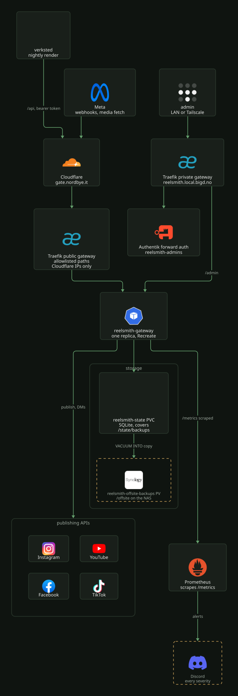

# Reelsmith

The reelsmith gateway publishes short videos to Instagram, Facebook, YouTube and TikTok on a
schedule, answers comments with DMs, and serves the files Meta fetches while it creates a post.
A render pipeline on [verksted](../verksted/README.md) produces the videos each night and hands them to the gateway over
`/api`. Only the gateway runs here; its source, CI and the render pipeline live in the separate
`mortennordbye/reelsmith` repo. The manifests are in
[`k8s/talos/apps/reelsmith/`](../../../k8s/talos/apps/reelsmith/kustomization.yaml).

[](../../assets/diagrams/reelsmith-flow.svg)

| Part | Where |
|---|---|
| Namespace | `reelsmith`, Pod Security `restricted` |
| Deployment | `reelsmith-gateway`, one replica, `Recreate`, port 8000 |
| Image | `ghcr.io/mortennordbye/reelsmith-gateway`, tag in the `images:` block of [`kustomization.yaml`](../../../k8s/talos/apps/reelsmith/kustomization.yaml) |
| Public host | `https://gate.nordbye.it`, public Traefik gateway, Cloudflare edges only |
| Control panel | `https://reelsmith.local.bigd.no/admin/`, private gateway, behind Authentik |
| State | PVC `reelsmith-state` (`syno-nfs-csi`, 1Gi): SQLite at `/state/gateway.sqlite3`, covers in `/state/covers` |
| Backup copies | `/state/backups`, and PV `reelsmith-offsite-backups` mounted at `/offsite` |
| Secrets | ExternalSecret `reelsmith-secret` |
| Alerts | [`monitoring.yaml`](../../../k8s/talos/apps/reelsmith/monitoring.yaml), sent to Discord at every severity |

## Deployment

Kargo project `reelsmith-cd` promotes new gateway images straight to prod through a pull
request against this repo, then curls `https://gate.nordbye.it/healthz` as the smoke test
([`kargo-projects/reelsmith.yaml`](../../../k8s/talos/infra/kargo-projects/reelsmith.yaml),
[kargo.md](../../platform/delivery/kargo.md)). Nothing deploys until that PR is merged. The inline
tag in [`deployment.yaml`](../../../k8s/talos/apps/reelsmith/deployment.yaml) is only a fallback;
the `images:` block wins.

The pod runs as uid 10001 with a read-only root filesystem and a writable `/tmp` emptyDir.
Reloader restarts it when `reelsmith-config` or `reelsmith-secret` changes.

It stays at one replica. SQLite has a single writer, and the comment poller and the scheduler are
singletons, so two pods would both reply and both publish. `Recreate` keeps a rollout from running
two pods for a moment. Scaling out needs Postgres and leader election first.

## Exposure

[`httproute.yaml`](../../../k8s/talos/apps/reelsmith/httproute.yaml) serves `gate.nordbye.it` on
the public gateway as an allowlist; any other path is a 404 at Traefik.

| Path | Match | Used by |
|---|---|---|
| `/webhook` | prefix | Meta subscription handshake and deliveries |
| `/media`, `/covers` | prefix | Meta fetching the video and cover for a post |
| `/api` | prefix | the render pipeline, with the `GATEWAY_API_TOKEN` bearer token |
| `/healthz` | prefix | Kargo smoke test (the kubelet probes hit the pod directly) |
| `/`, `/privacy`, `/terms` | exact | policy pages registered on the platforms' app records |
| `/tiktok/callback`, `/facebook/callback` | exact | OAuth redirects for the consent trips |

`/`, `/privacy` and `/terms` must stay `Exact`. A `/` prefix would match every path and put
`/admin` and `/metrics` on the internet. A new route in the app needs a line here too. The
`reelsmith-cloudflare-only` middleware admits only Cloudflare's ranges, the same list as
`trustedIPs` in [`traefik/values.yaml`](../../../k8s/talos/infra/traefik/values.yaml), and uses
no `ipStrategy` because `X-Forwarded-For` can be spoofed. DNS for `gate` is in
[cloudflare.md](../../platform/network/cloudflare.md).

[`httproute-admin.yaml`](../../../k8s/talos/apps/reelsmith/httproute-admin.yaml) serves
`reelsmith.local.bigd.no` on the private gateway. `/` redirects to `/admin/` with a 302,
`/outpost.goauthentik.io/` goes to `authentik-server` in `identity` without auth (a
ReferenceGrant there allows it), and everything else goes through the `reelsmith-authentik`
forward-auth middleware. The Authentik side is
[`reelsmith-blueprint.yaml`](../../../k8s/talos/infra/authentik/reelsmith-blueprint.yaml): a
`forward_single` proxy provider, and access limited to the group `reelsmith-admins`. Members are
declared in the blueprint, because reconciliation resets the list.

[`ciliumnetworkpolicy.yaml`](../../../k8s/talos/apps/reelsmith/ciliumnetworkpolicy.yaml) admits
port 8000 only from Traefik and Prometheus, plus the `host` and `health` entities for probes, and allows egress only to
CoreDNS and, on port 443, the publishing APIs: the Instagram and Facebook Graph
hosts, `rupload.facebook.com`, the Google API and OAuth hosts, and `*.tiktokapis.com`
(TikTok hands out its upload host per request). A new platform in the gateway needs
its host added there.

## Configuration

Schedule and feature flags are in
[`configmap.yaml`](../../../k8s/talos/apps/reelsmith/configmap.yaml).

- `GATEWAY_SCHEDULER_ENABLED` is the master switch. Off, the gateway still answers comments but
  never publishes.
- `GATEWAY_SLOTS` holds one slot per line, `HH:MM [zone] [jitter=N]` plus the identity it posts
  for (`account=<id>` or `brand=<name>`). Every line must name its identity: an unattributed line
  with several accounts registered, or a brand that matches no account, freezes the whole
  config sweep. A line that does not parse fails startup. Removing an account's last line removes
  its slots. Jitter is derived from slot and date, so a restart cannot publish twice.
- The Facebook id is the Page id from `GET /me/accounts`, not the number in the Page's URL.
- `GATEWAY_ADMIN_TRUST_PROXY_AUTH: "true"` means the app checks nothing itself on `/admin`.
  Authentik on the private route is the only lock, so `/admin` must never be routed through any
  other gateway, and the network policy must keep port 8000 closed to other pods.
- `GATEWAY_TIKTOK_ENABLED` also gates the TikTok token refresher and insights loops. With it off,
  a queued TikTok post fails at its slot instead of retrying.
- `GATEWAY_TIKTOK_PRIVACY_LEVEL` must be one of the options TikTok's `creator_info` returns, or
  posts fail with `privacy_level_option_mismatch`. `GATEWAY_TIKTOK_DIRECT_POST` stays `false` while
  the TikTok client is unaudited.

`reelsmith-secret` carries `GATEWAY_APP_SECRET` (signs Meta webhook deliveries),
`GATEWAY_VERIFY_TOKEN` (must match the value in the Meta dashboard) and `GATEWAY_API_TOKEN` (the
render pipeline's bearer token). The pod does not start without all three. Replacing the value in
Bitwarden rolls it within the hour: ESO refreshes hourly and Reloader restarts the pod.

## State and backups

The SQLite database and the cover images are on `reelsmith-state`, a dynamic `syno-nfs-csi` PVC
with reclaim policy `Delete`. SQLite runs in WAL mode; if locking misbehaves on NFS, the fix is
the journal mode in the gateway's `gateway/db.py`, not a storage migration.

Reelsmith is not in VolSync. The gateway backs up its own database with `VACUUM INTO`:

- `/state/backups` on the state volume, the newest 14 kept. These go with the PVC: the driver
  archives its directory on the NAS rather than deleting it, but a recreated claim starts empty
  (see [storage](../../platform/storage/README.md#deleting-a-pvc)).
- `/offsite`, a second copy on the statically bound PV `reelsmith-offsite-backups`
  (`nas.local.bigd.no:/volume1/shared-data/media/reelsmith`, reclaim `Retain`), mounted with
  `subPath: gateway-backups`. On the NAS they are in
  `/volume1/shared-data/media/reelsmith/gateway-backups`.

The offsite volume is a PV and PVC, not an inline `nfs` volume, because the namespace enforces
Pod Security `restricted`, which rejects inline NFS volumes. The subPath keeps the render
pipeline's files beside it on the share out of the pod.

The answered-comments record in the database cannot be rebuilt from anywhere else. Restore steps
are in [restore.md](../../platform/backups/restore.md#reelsmith).

## Alerts

| Alert | Means | Action |
|---|---|---|
| `ReelsmithTokenExpiring`, `ReelsmithTokenAboutToDie` | an account token has under 10 or 2 days left | check the refresher in the logs; once expired it can only be re-authorised by hand in a browser, and publishing, DMs and insights stop for that account |
| `ReelsmithPollerStalled` | no comment poll sweep for over 10 minutes | comment-to-DM is off until it recovers |
| `ReelsmithSchedulerStalled` | no scheduler tick for over 10 minutes | a missed slot is not retried |
| `ReelsmithQueueStarved` | a slot came due with nothing approved | render and enqueue, or approve queued posts in the panel |
| `ReelsmithBackupStale`, `ReelsmithOffsiteBackupStale` | no backup, or no offsite copy, in 24 h | usually a full state volume, or the offsite mount gone |
| `ReelsmithRenderHostSilent` | no finished render run for a brand in 30 h | check `/data/repos/reelsmith/build/nightly.log` in `verksted-app` |
| `ReelsmithPublishFailing` | a platform rejected a publish in the last hour | the row stays queued and retries |
| `ReelsmithPostStuck` | a row sits in `failed` | decide in the panel, see below |
| `ReelsmithClaimAbandoned` | a row sits in `claimed` past `CLAIM_STALE_AFTER` (1 h) | decide in the panel, see below |

Logs for most of them:

```sh
kubectl -n reelsmith logs deploy/reelsmith-gateway | grep -i token   # or backup, offsite, publish
```

## Failed and abandoned posts

Neither state is self-healed, because the platform may already have accepted the post. A
publish that failed after the container was created, or a process that died between container
creation and publish, can leave a live Reel behind a row that looks unfinished.

1. List the claimed rows (read-only, opens the database with `mode=ro`, safe while the gateway
   runs): [`scripts/reelsmith-stale-claims.sh`](../../../scripts/reelsmith-stale-claims.sh).
2. Check the account for the post.
3. Resolve the row in the panel at `https://reelsmith.local.bigd.no/admin/`. Re-arming a row whose
   post already went live publishes it twice.

A claimed row keeps its media exempt from the retention sweep until it is resolved. A `failed`
row with "no video file" means the retention sweep deleted a queued file.

## Traps

- The Service carries the label `app: reelsmith-gateway` for the ServiceMonitor. Without it
  Prometheus creates no target at all.
- The network policy's Prometheus ingress rule is what lets `/metrics` be scraped; without it the
  target shows as down.
- `GATEWAY_PUBLIC_BASE_URL` is the external `https://gate.nordbye.it`, because Meta fetches covers
  from it.
- The Kargo Warehouse keeps `discoveryLimit: 10`; old tags point at pruned manifests and a larger
  window fails discovery.
