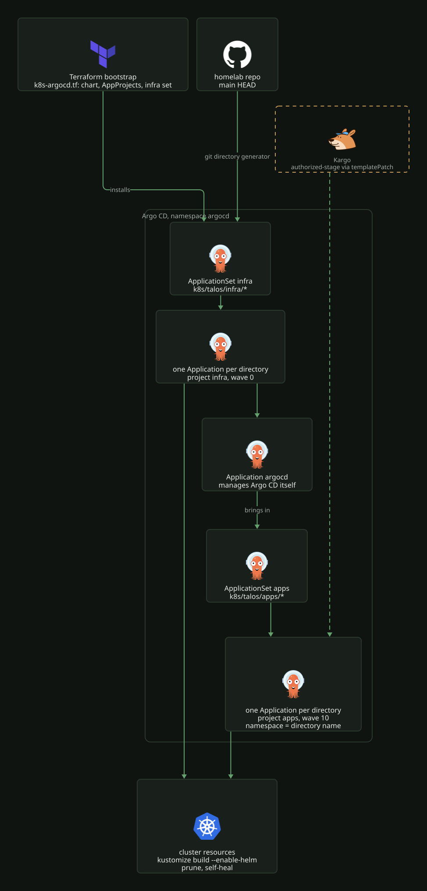

# Argo CD

Argo CD owns everything in the cluster. It is installed from the `argo-cd` Helm chart,
rendered by kustomize in [`k8s/talos/infra/argocd/`](../../../k8s/talos/infra/argocd/),
and manages itself: the `argocd` directory is one of the Applications it syncs. Every
Application tracks `HEAD` of `main`, so a merge is a deploy and a direct `kubectl apply`
is reverted by self-heal.

## Applications from directories

Two ApplicationSets use the git directory generator on this repo. Each directory one
level below the path becomes one Application named after the directory.

| ApplicationSet | Directories | Project | Destination namespace | Application sync wave |
|---|---|---|---|---|
| [`infra`](../../../k8s/talos/infra/argocd/infra.yaml) | `k8s/talos/infra/*` | `infra` | none, manifests set their own | `0` |
| [`apps`](../../../k8s/talos/infra/argocd/apps.yaml) | `k8s/talos/apps/*` | `apps` | the directory name | `10` |

Adding an app is adding a directory; deleting the directory deletes the Application and,
through the `resources-finalizer.argocd.argoproj.io` finalizer, everything it created.
Neither set uses `CreateNamespace`, so a directory ships its own `Namespace` manifest. A
manifest that names a namespace explicitly wins over the `apps` destination, which is
how the `<app>-stage` directories deploy to `stage-<app>`.

Argo CD builds each directory with `kustomize build --enable-helm`
(`kustomize.buildOptions` in [`values.yaml`](../../../k8s/talos/infra/argocd/values.yaml)),
so a directory is either plain manifests with a `kustomization.yaml` or a `helmCharts:`
entry with a local `values.yaml`.

Both sets share the same sync policy:

| Setting | Effect |
|---|---|
| `automated.prune`, `automated.selfHeal` | Removes what left Git and reverts drift |
| `retry.limit: 1` | One retry, backoff 10 s doubling up to 3 min |
| `ApplyOutOfSyncOnly=true` | A sync only applies the resources that differ |
| `PruneLast=true` | Pruning runs after every other resource is healthy |
| `ServerSideApply=true` | No `last-applied-configuration` annotation, so large CRDs and ConfigMaps fit |
| `RespectIgnoreDifferences=true` | Fields listed in `ignoreDifferences` are left alone on sync too |

The `apps` set adds one `ignoreDifferences` entry: `/spec/replicas` on every Deployment.
KEDA owns the replica count of the apps that scale to zero ([`keda.md`](keda.md)), and
without this entry self-heal would reset it. The same entry means a `replicas` change in
Git is not applied to a Deployment that already exists; scale it by hand or recreate it.

The `apps` set also has a `templatePatch` that stamps `kargo.akuity.io/authorized-stage`
on the Applications Kargo promotes. It needs `goTemplate: true`, so its fields use the
`{{.path.*}}` syntax while `infra` keeps the older `{{ path }}` form. Onboarding and the
offline check for the patch are in [`kargo.md`](kargo.md).

## Projects

[`project-apps.yaml`](../../../k8s/talos/infra/argocd/project-apps.yaml) and
[`project-infra.yaml`](../../../k8s/talos/infra/argocd/project-infra.yaml) define the
AppProjects `apps` and `infra`. Both allow only this repo as a source and allow every
destination and every resource kind, cluster scoped included. They separate the two sets
in the UI and in RBAC; they do not restrict anything.

## Sync waves

Waves order resources inside one Application. The ones in use:

| Wave | Used for |
|---|---|
| `-3` | Authentik's `identity` namespace |
| `-2` | Authentik's ExternalSecret; everything in cert-manager and Cilium (`commonAnnotations`) |
| `-1` | Authentik blueprint ConfigMaps, the Kargo Project namespaces, External Secrets Operator, the Grafana OIDC ExternalSecret |
| `0` | Default; most app kustomizations set it explicitly; Kargo Projects |
| `1` | Some ExternalSecrets, ReferenceGrants, Traefik, Kargo ProjectConfigs and Warehouses |
| `2` | HTTPRoutes, Traefik Middlewares, several namespaces and ExternalSecrets, Kargo AnalysisTemplates and Stages |
| `201` | cert-manager Certificates, after the rest of cert-manager |

The Application-level waves in the two templates (`0` and `10`) are not an ordering
guarantee: the ApplicationSet controller creates all Applications at once, and each one
syncs on its own. Anything that must exist first, such as CRDs, is either in the same
Application or tolerated with `SkipDryRunOnMissingResource=true`, as the VolSync
`ReplicationSource`s do.

## Per-resource sync options

| Where | Option | Why |
|---|---|---|
| [`dashboards/kustomization.yaml`](../../../k8s/talos/infra/kube-prometheus-stack/dashboards/kustomization.yaml) | `ServerSideApply=true` | The SPOG dashboard JSON is over the 256 KiB annotation limit of client-side apply |
| `volsync.yaml` in each backed-up app | `SkipDryRunOnMissingResource=true` | The VolSync CRDs come from the `volsync` Application |
| [`talos-serviceaccount.yaml`](../../../k8s/talos/infra/etcd-backup/talos-serviceaccount.yaml) | `SkipDryRunOnMissingResource=true` | The `talos.dev` CRD exists only once Talos `kubernetesTalosAPIAccess` is on |
| [`cilium/namespace.yaml`](../../../k8s/talos/infra/cilium/namespace.yaml) | `Prune=false` | The namespace is never pruned |

Cilium `CiliumIdentity` objects are excluded from tracking through `resource.exclusions`.

## Access

| Item | Value |
|---|---|
| UI | `https://argocd.local.bigd.no` through `traefik-gateway-private` ([`httproute.yaml`](../../../k8s/talos/infra/argocd/httproute.yaml)) |
| LoadBalancer | `10.3.10.100` (Cilium LB IPAM) |
| SSO | Authentik OIDC, issuer `https://auth.local.bigd.no/application/o/argocd/` |
| Admin group | `argocd-admins` maps to `role:admin`; any other SSO user gets no permissions |
| Break-glass | The built-in `admin` account stays enabled and bypasses RBAC |

The OIDC client secret comes from Bitwarden through the ExternalSecret `argocd-oidc`
([`argocd-oidc-secret.yaml`](../../../k8s/talos/infra/argocd/argocd-oidc-secret.yaml)),
the same item Authentik reads for its side. The provider, application slug and group are
declared in [`argocd-blueprint.yaml`](../../../k8s/talos/infra/authentik/argocd-blueprint.yaml);
see [identity](../identity/README.md). Dex is disabled.

The admin password of a fresh install is in `argocd-initial-admin-secret`; the command
is in [`talos.md`](../cluster/talos.md#access).

## Components

| Component | Replicas | PDB |
|---|---|---|
| server | 2 | `maxUnavailable: 1` |
| repo-server | 2 | `maxUnavailable: 1` |
| applicationset-controller | 2 | `maxUnavailable: 1` |
| application-controller | 1 | none |

Redis runs as a single instance (`redis-ha` off). Notifications are enabled. server,
repo-server and application-controller expose ServiceMonitors for kube-prometheus-stack.

## Bootstrap

Terraform installs the chart with the same `values.yaml` and applies the two AppProjects
and the `infra` ApplicationSet
([`k8s-argocd.tf`](../../../terraform/proxmox/hyper-cluster/k8s/talos/k8s-argocd.tf)).
The `infra` set then creates the `argocd` Application, which brings in the `apps` set.
The `helm_release` ignores all changes after creation, so upgrades go through the chart
version in [`kustomization.yaml`](../../../k8s/talos/infra/argocd/kustomization.yaml), not
Terraform. The full cluster bootstrap is in [`talos.md`](../cluster/talos.md).

## Gotchas

The `argocd` namespace runs under a default-deny CiliumNetworkPolicy
([`ciliumnetworkpolicy.yaml`](../../../k8s/talos/infra/argocd/ciliumnetworkpolicy.yaml)).
Egress to the internet is limited to GitHub, `ghcr.io`, `*.github.io` and a fixed list of
Helm repositories, which is what repo-server renders from. A chart from a new repository fails to render until its host is added to
the `toFQDNs` list.

The OIDC issuer needs its trailing slash, and its path segment is the Authentik
application slug, not the provider name. A mismatch gives `oidc: issuer did not match`.
Authentik has no `groups` scope; the claim rides on `profile`, and requesting `groups`
returns `invalid_scope`.

argocd-server only resolves `$argocd-oidc:clientSecret` from a Secret labelled
`app.kubernetes.io/part-of: argocd`, which the ExternalSecret template sets.

## Argo Rollouts

[`k8s/talos/infra/argo-rollouts/`](../../../k8s/talos/infra/argo-rollouts/) installs the
`argo-rollouts` chart only for its AnalysisTemplate and AnalysisRun CRDs and controller.
Kargo uses them for Stage verification: each Stage's smoke test is an AnalysisTemplate
that runs a curl Job ([`kargo.md`](kargo.md)). No workload uses the `Rollout` kind, and
the dashboard is off.
