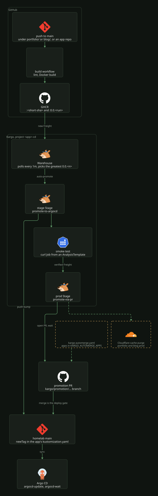

# Kargo app promotion

Kargo promotes container images into the cluster on top of Argo CD. CI only builds
and pushes the image; Kargo notices the new tag, rewrites `newTag` in the app's
kustomization, commits it to this repo and syncs the Argo CD Application. Every
app that ships its own image runs through it.

## Pipelines

Each app has a Warehouse that watches one GHCR repo and auto-promotes new Freight
into its first Stage. A second Stage only receives Freight that passed the first
one's smoke test.

| App | Image | Stages | Smoke test |
| --- | --- | --- | --- |
| portfolio | `ghcr.io/mortennordbye/homelab/portfolio` | stage, prod | `https://portfolio-stage.local.bigd.no/`, then `https://nordbye.it/` |
| blog | `ghcr.io/mortennordbye/homelab/blog` | stage, prod | `https://blog-stage.local.bigd.no`, then `https://blog.nordbye.it` |
| headroom | `ghcr.io/mortennordbye/headroom` | demo, prod | `https://headroom.nordbye.it` (demo), `https://headroom.local.bigd.no/` (prod) |
| logeverylift | `ghcr.io/mortennordbye/logeverylift` | prod | `https://logeverylift.com/` |
| verksted | `ghcr.io/mortennordbye/verksted` | prod | `https://verksted.local.bigd.no/` |
| reelsmith | `ghcr.io/mortennordbye/reelsmith-gateway` | prod | `https://gate.nordbye.it/healthz` |
| innestemme | `ghcr.io/mortennordbye/innestemme` | prod | `http://innestemme.innestemme.svc.cluster.local:9090/healthz` |

Every `stage` and `demo` Stage uses `promote-to-argocd`; every `prod` Stage uses
`promote-via-pr`. The smoke tests are AnalysisTemplates in each `<app>.yaml` that
run a curl Job; the ones on `*.local.bigd.no` and on `nordbye.it`, `blog.nordbye.it`
and `logeverylift.com` pass `-k`, the headroom demo and reelsmith ones verify TLS, and innestemme's is plain HTTP
on its in-cluster Service.
portfolio and blog prod also purge the Cloudflare cache for `nordbye.it` after
the sync, using the `cloudflare-api-token` ExternalSecret in their Project.

## Promotion tasks

Both live in `k8s/talos/infra/kargo-projects/` as ClusterPromotionTasks. Stages
only supply the vars `appName`, `appPath`, `imageRepo` and `argocdApp`.

`promote-to-argocd` (`clusterpromotiontask.yaml`) runs git-clone,
kustomize-set-image, git-commit, git-push to `main`, argocd-update, argocd-wait.

`promote-via-pr` (`clusterpromotiontask-pr.yaml`) pushes the bump to a generated
`kargo/promotion/...` branch, opens a homelab PR, and blocks in git-wait-for-pr until
it is merged, then runs argocd-update and argocd-wait. Merging the PR is the deploy
gate.

argocd-wait blocks until the Application is Synced and Healthy. `desiredRevision` is
not pinned on argocd-update: apps track shared `main` HEAD, and a pinned revision
reports the Stage Unhealthy as soon as any other commit lands. The smoke test is the
real verification.

## Facts

| Item | Value |
| --- | --- |
| Project and namespace | `<app>-cd`, separate from the app namespace |
| Image tags | CI pushes a strict SemVer `0.0.<n>` tag per build; the Warehouse (`SemVer`, `strictSemvers`) picks the greatest |
| Git write | GitHub App `mortennordbye-homelab-deployer`, credential per Project via ESO |
| Sync permission | `kargo.akuity.io/authorized-stage` on the Argo CD app, stamped by `k8s/talos/infra/argocd/apps.yaml` |
| Discovery latency | about 1 minute: Warehouses poll at `interval: 1m0s` |
| PR labels | `kargo`, `app/<name>`, `env/<stage>`, set by git-open-pr |
| UI | `https://kargo.local.bigd.no`, Authentik SSO (group `kargo-admins`), admin account kept as break-glass |
| Versions | Kargo chart in `k8s/talos/infra/kargo/kustomization.yaml`, Argo Rollouts in `k8s/talos/infra/argo-rollouts/kustomization.yaml` |

## Files

| Path | Purpose |
| --- | --- |
| `k8s/talos/infra/kargo/` | Kargo install (Helm OCI chart), values, UI route |
| `k8s/talos/infra/argo-rollouts/` | AnalysisTemplate and AnalysisRun CRDs used for verification |
| `k8s/talos/infra/kargo-projects/clusterpromotiontask.yaml` | `promote-to-argocd` |
| `k8s/talos/infra/kargo-projects/clusterpromotiontask-pr.yaml` | `promote-via-pr` |
| `k8s/talos/infra/kargo-projects/<app>.yaml` | One multi-document file per app: Namespace, Project, ProjectConfig, git credential, Warehouse, AnalysisTemplates, Stages |
| `k8s/talos/infra/argocd/apps.yaml` | `authorized-stage` annotations via `templatePatch` |
| `.github/workflows/kargo-automerge.yaml` | Squash-merges promotion PRs for apps in `KARGO_AUTOMERGE_APPS` |

## Operate

Deploying to prod is automatic up to the gate: merge the PR Kargo opens
(`chore(<app>): promote <tag> to prod`). Nothing reaches prod without that merge.

Apps listed in the `KARGO_AUTOMERGE_APPS` repository variable skip the click:
`kargo-automerge.yaml` squash-merges their promotion PR once it carries the
`app/<name>` label. Check the current list with `gh variable get KARGO_AUTOMERGE_APPS`.
Editing the variable (Settings, Secrets and variables, Actions) is the kill switch,
per app or for all of them, with no commit. Kargo still opens the PR and waits on it,
so removing an app just puts a human back in front of the merge.

A build is triggered by a push under the app's path (in-repo apps) or to the app
repo's `main` (external apps). Inspect a pipeline with
`kubectl -n <app>-cd get warehouse,stage,freight,promotion`.

## Onboard an app

In-repo app with stage and prod, like portfolio or blog:

1. Add an `images:` block to the prod and stage kustomizations with
   `name: ghcr.io/mortennordbye/homelab/<app>` and `newTag` set to the tag running now.
2. The build workflow runs with `contents: read` and pushes a
   `0.0.${{ github.run_number }}` tag. It never writes manifests.
3. Copy `portfolio.yaml` to `kargo-projects/<app>.yaml` and register it in
   `kargo-projects/kustomization.yaml`.
4. Add `<app>` to the list in the `apps.yaml` `templatePatch`.

External-repo app with a single prod Stage, like logeverylift:

1. Put the deploy manifests under `k8s/talos/apps/<app>/` with an `images:` block
   (`name: ghcr.io/mortennordbye/<app>`, `newTag` set to the current tag).
2. Copy `logeverylift.yaml` to `kargo-projects/<app>.yaml`: one Warehouse, one
   auto-promoted `prod` Stage on `promote-via-pr`, one smoke AnalysisTemplate on the
   app's URL. Register it in `kargo-projects/kustomization.yaml` and add `<app>` to
   the `apps.yaml` list.
3. In the app repo's build workflow, push
   `type=raw,value=0.0.${{ github.run_number }},enable={{is_default_branch}}`.

The Warehouse has no Freight until the first `0.0.<n>` build, so merge order does not
matter. For the git credential, copy the ExternalSecret from an existing Project:
same Bitwarden keys and the same `conversionStrategy`, `decodingStrategy` and
`metadataPolicy` fields, only the `namespace` changes to `<app>-cd`.

## Gotchas

Inside a ClusterPromotionTask, one step references another's output as
`task.outputs['<alias>']`, not `outputs.<alias>`. Task steps are inflated with a
prefix at Promotion time, so plain `outputs.*` resolves to nil: git-open-pr then gets
an empty branch and the bump strands on an orphan branch while the promotion reports
Succeeded.

The no-op guard keys on the commit step's status, not on a branch or an output.
git-commit is skipped when there is nothing to commit, and push, open-pr and wait-pr
carry `if: ${{ status('commit') != 'Skipped' }}`. argocd-update and argocd-wait stay
unguarded so a no-op re-promotion still ends green.

A Warehouse polls at the greater of its `spec.interval` and the controller's
`minReconciliationInterval`, which `k8s/talos/infra/kargo/values.yaml` sets to `1m0s`.
Lowering a Warehouse below that needs both changed.

Commit authorship is set on git-clone. Unset, Kargo authors as
`Kargo <no-reply@kargo.io>` and GitHub adds a `Co-authored-by:` trailer to the squash
commit. git-commit's own `author` field is deprecated.

The GitHub App needs Pull requests read/write as well as Contents read/write, or
git-open-pr fails. The credential takes the Installation ID, not the App ID; a wrong
value makes git-push fail with a 404 on the installation token call.

The `<app>-stage` overlay directory deploys to namespace `stage-<app>`. Every stage
manifest declares that namespace explicitly, and that wins over the ApplicationSet.

ESO remoteRefs and Warehouses must spell out defaulted fields
(`conversionStrategy`, `decodingStrategy`, `metadataPolicy`; `strictSemvers`,
`interval`, `discoveryLimit`), or Argo CD reports them OutOfSync forever.

Per-app annotations in the `apps` ApplicationSet go in `templatePatch`, since an
inline `{{if}}` in the parsed `template` is invalid YAML. Check the output offline with
`argocd appset generate --core -n argocd <file>` after swapping the git generator for
a `list` generator.
