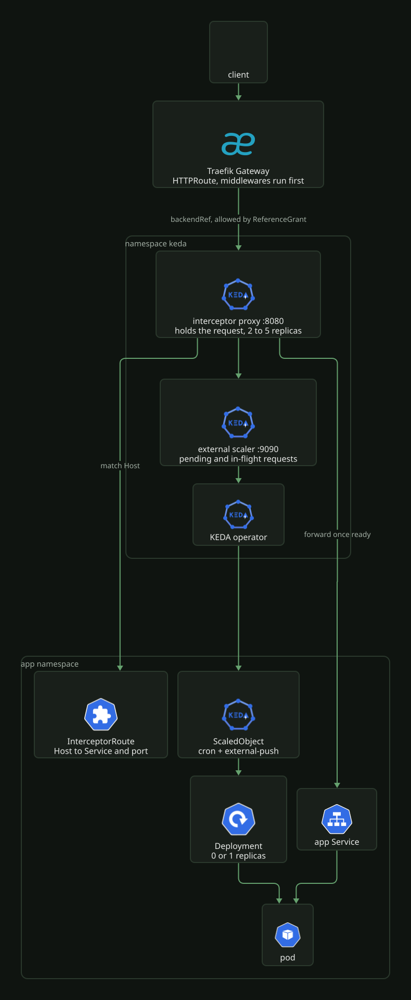
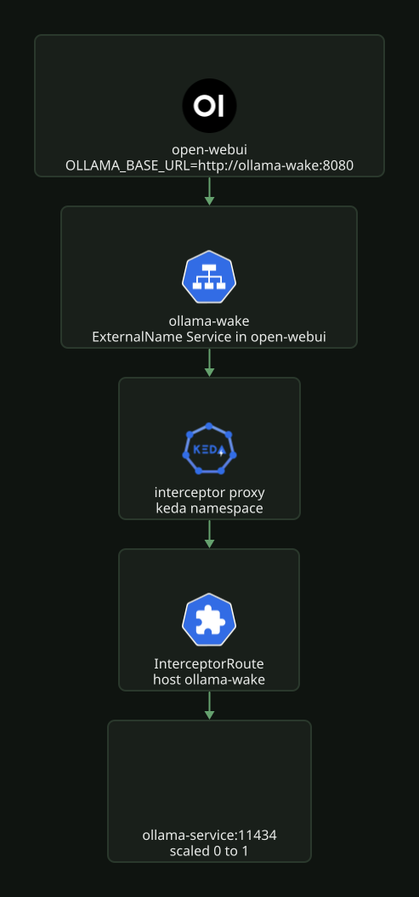

# KEDA scale to zero

KEDA scales app Deployments on schedules and on HTTP traffic. The KEDA HTTP add-on
puts an interceptor proxy in front of idle apps: Traefik sends their traffic to the
interceptor instead of the app Service, the interceptor holds the request, KEDA scales
the Deployment from zero, and the interceptor forwards the request once a pod is ready.

## Install

Two Argo CD Applications from the `infra` ApplicationSet, both in namespace `keda`.

| App | Chart | Version | Values |
| --- | --- | --- | --- |
| `keda` | `kedacore/keda` | [`kustomization.yaml`](../../../k8s/talos/infra/keda/kustomization.yaml) | [`values.yaml`](../../../k8s/talos/infra/keda/values.yaml): one operator replica, operator and metrics server ServiceMonitors |
| `keda-http-add-on` | `kedacore/keda-add-ons-http` | [`kustomization.yaml`](../../../k8s/talos/infra/keda-http-add-on/kustomization.yaml) | [`values.yaml`](../../../k8s/talos/infra/keda-http-add-on/values.yaml): interceptor between 2 and 5 replicas |

The `keda` Application owns the `keda` namespace
([`namespace.yaml`](../../../k8s/talos/infra/keda/namespace.yaml)). The add-on deploys
into it and must not declare its own Namespace: two Applications claiming the same
resource fight over its ownership, the same rule loki and tempo follow for `monitoring`.

The add-on directory also carries:

- [`referencegrant.yaml`](../../../k8s/talos/infra/keda-http-add-on/referencegrant.yaml),
  which lets HTTPRoutes in the listed app namespaces reference a Service in `keda`.
- [`servicemonitor.yaml`](../../../k8s/talos/infra/keda-http-add-on/servicemonitor.yaml),
  which scrapes the add-on's external scaler.

The chart's own ScaledObject scales the interceptor (`keda-add-ons-http-interceptor`
in `keda`) between the min and max in the values file.

## Request path

[](../../assets/diagrams/delivery-keda-request.svg)

- The app's HTTPRoute keeps its hostname and filters, but its `backendRef` is the
  Service `keda-add-ons-http-interceptor-proxy` in namespace `keda`, port `8080`.
  Middlewares such as Authentik forward auth run at Traefik first, so only requests
  that pass them reach the interceptor and wake the pod
  ([`homepage/httproute.yaml`](../../../k8s/talos/apps/homepage/httproute.yaml)).
- The interceptor picks the target by the request's `Host` header. The app's
  InterceptorRoute lists that host under `spec.rules[].hosts` and names the app Service
  and port under `spec.target`.
- The app's ScaledObject has an `external-push` trigger pointing at
  `keda-add-ons-http-external-scaler.keda:9090` with `interceptorRoute: <name>`. The
  external scaler reports pending and in-flight requests for that route to KEDA, which
  scales the Deployment. Every route uses a concurrency target of 100.
- The app's CiliumNetworkPolicy allows ingress on the container port from pods in
  `keda` labelled `app.kubernetes.io/component: interceptor` and
  `app.kubernetes.io/part-of: keda-add-ons-http`.

Argo CD ignores `/spec/replicas` on every Deployment in the `apps` ApplicationSet
([`apps.yaml`](../../../k8s/talos/infra/argocd/apps.yaml)), so a `replicas:` value in a
manifest does not fight KEDA.

## Apps

| App | Namespace | Host | Min / max | Triggers |
| --- | --- | --- | --- | --- |
| audiobookshelf | `audiobookshelf` | `audiobookshelf.bigd.no` | 0 / 1 | cron, HTTP |
| homepage | `homepage` | `hub.bigd.no` | 0 / 1 | cron, HTTP |
| it-tools | `it-tools` | `it-tools.bigd.no` | 0 / 1 | cron, HTTP |
| omni-tools | `omni-tools` | `omni-tools.bigd.no` | 0 / 1 | cron, HTTP |
| trek | `trek` | `trek.bigd.no` | 0 / 1 | cron, HTTP |
| headroom | `headroom` | `headroom.local.bigd.no` | 0 / 1 | cron, HTTP |
| open-webui | `open-webui` | `open-webui.local.bigd.no` | 0 / 1 | cron, HTTP |
| portfolio-stage | `stage-portfolio` | `portfolio-stage.local.bigd.no` | 0 / 1 | HTTP |
| blog-stage | `stage-blog` | `blog-stage.local.bigd.no` | 0 / 1 | HTTP |
| ollama | `ollama` | `ollama-wake` (in-cluster only) | 0 / 1 | HTTP |
| portfolio | `portfolio` | none | 1 / 3 | cron |
| blog | `blog` | none | 1 / 3 | cron |

The first five are on `traefik-gateway-public`; headroom, open-webui and the two stage
apps are on `traefik-gateway-private`. Each app's files are `scaledobject.yaml` and,
for the HTTP-triggered ones, `interceptorroute.yaml` under `k8s/talos/apps/<app>/`.

portfolio and blog prod do not go through the interceptor. Their ScaledObjects
([`portfolio/scaledobject.yaml`](../../../k8s/talos/apps/portfolio/scaledobject.yaml))
only use cron: 3 replicas from 07:00 to 23:00 Europe/Oslo, 1 outside it.

## Cron warm plus HTTP wake

Most HTTP-triggered apps carry two triggers
([`it-tools/scaledobject.yaml`](../../../k8s/talos/apps/it-tools/scaledobject.yaml)):

```yaml
triggers:
  - type: cron
    metadata:
      timezone: Europe/Oslo
      start: "0 7 * * *"
      end: "0 23 * * *"
      desiredReplicas: "1"
  - type: external-push
    metadata:
      scalerAddress: keda-add-ons-http-external-scaler.keda:9090
      interceptorRoute: it-tools
```

KEDA scales to the highest value any trigger asks for. From 07:00 to 23:00 Oslo time
the cron holds one replica, so the app never cold-starts during the day. Outside that
window only the HTTP trigger counts: the app sits at zero and the first request wakes
it. `cooldownPeriod: 300` keeps a woken pod for five minutes after the last request.

The stage apps and ollama have only the HTTP trigger and sit at zero until used.

## Waking ollama from open-webui

ollama has no HTTPRoute. open-webui calls it in-cluster, and a direct call to
`ollama-service` would not wake a pod that is at zero. Instead:

[](../../assets/diagrams/delivery-keda-ollama.svg)

- [`open-webui/ollama-wake.yaml`](../../../k8s/talos/apps/open-webui/ollama-wake.yaml)
  is an `ExternalName` Service named `ollama-wake` in `open-webui` that resolves to
  `keda-add-ons-http-interceptor-proxy.keda.svc.cluster.local`.
- open-webui sets `OLLAMA_BASE_URL` to `http://ollama-wake:8080`
  ([`deployment.yaml`](../../../k8s/talos/apps/open-webui/deployment.yaml)), so its
  requests reach the interceptor with `Host: ollama-wake`.
- [`ollama/interceptorroute.yaml`](../../../k8s/talos/apps/ollama/interceptorroute.yaml)
  matches the host `ollama-wake` and targets `ollama-service:11434`.

The same pattern works for any in-cluster caller that should wake a scaled-to-zero
backend: an ExternalName alias in the caller's namespace and an InterceptorRoute on
the alias name. No ReferenceGrant is needed, since no HTTPRoute is involved. The
backend's network policy must admit the interceptor; ollama's
([`ciliumnetworkpolicy.yaml`](../../../k8s/talos/apps/ollama/ciliumnetworkpolicy.yaml))
allows port 11434 from the whole cluster.

## Onboard an app

Built from it-tools. The app already has a Deployment, Service, HTTPRoute and
CiliumNetworkPolicy under `k8s/talos/apps/<app>/`.

1. Add `interceptorroute.yaml`: copy
   [`it-tools/interceptorroute.yaml`](../../../k8s/talos/apps/it-tools/interceptorroute.yaml),
   set the namespace, `spec.target.service` and `port` to the app Service, and
   `spec.rules[].hosts` to the exact hostname in the HTTPRoute.
2. Add `scaledobject.yaml`: copy
   [`it-tools/scaledobject.yaml`](../../../k8s/talos/apps/it-tools/scaledobject.yaml),
   set `scaleTargetRef.name` to the Deployment and `interceptorRoute` to the
   InterceptorRoute's name. Drop the cron trigger if the app may sit at zero all day.
3. In `httproute.yaml`, replace the app Service in `backendRefs` with
   `keda-add-ons-http-interceptor-proxy`, namespace `keda`, port `8080`
   ([`it-tools/httproute.yaml`](../../../k8s/talos/apps/it-tools/httproute.yaml)).
   Keep the hostnames and filters.
4. In `ciliumnetworkpolicy.yaml`, add an ingress rule from the interceptor pods on the
   container port
   ([`it-tools/ciliumnetworkpolicy.yaml`](../../../k8s/talos/apps/it-tools/ciliumnetworkpolicy.yaml)).
5. Add both new files to the app's `kustomization.yaml`.
6. Add the app namespace to the `from` list in
   [`referencegrant.yaml`](../../../k8s/talos/infra/keda-http-add-on/referencegrant.yaml).
   Without it the HTTPRoute's cross-namespace backendRef is not permitted and
   Traefik does not route the host.

Verify after Argo CD syncs:

```bash
kubectl -n <ns> get scaledobject,interceptorroute
kubectl -n <ns> get deploy <app> -w   # 0 at night, 1 after a request
```

`kubectl get scaledobject -A` should list the app with `READY True` and its triggers.
`ACTIVE` is `True` while a trigger wants replicas, for example inside the cron window.

## Gotchas

The InterceptorRoute host and the HTTPRoute hostname must match exactly. A request
whose `Host` matches no InterceptorRoute is not forwarded anywhere, even though
Traefik routed it to the interceptor.

The network policy rule is easy to miss: without it the interceptor can wake the pod
but Cilium drops the request it forwards.

portfolio and blog prod keep `minReplicaCount: 1` and bypass the interceptor, so the
public sites never cold-start.
