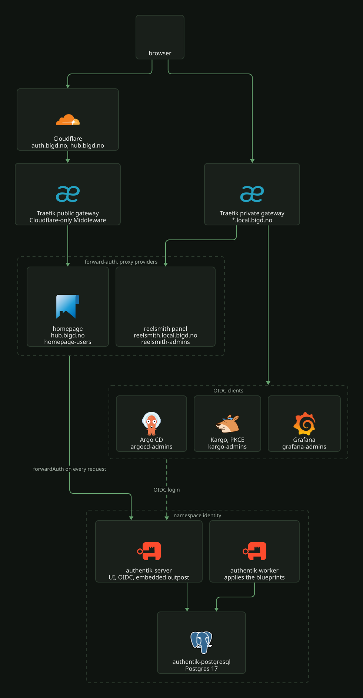

# Identity: Authentik

Authentik is the single sign-on for the cluster. It runs in the `identity` namespace from
the upstream Helm chart, inflated by kustomize in
[`k8s/talos/infra/authentik/`](../../../k8s/talos/infra/authentik/kustomization.yaml), with
its settings in [`values.yaml`](../../../k8s/talos/infra/authentik/values.yaml). Everything
it serves (users, groups, providers, applications, flows, the outpost) is declared in
blueprints, so a rebuilt cluster comes back with the same logins without anyone using the
admin UI.

| Piece | What it is |
| --- | --- |
| `authentik-server` | web UI, OIDC endpoints and the embedded outpost, Service port 80 |
| `authentik-worker` | runs the blueprints and manages the outpost through the Kubernetes API |
| `authentik-postgresql` | the chart's Postgres 17 StatefulSet, 8 Gi on `syno-nfs-csi` |
| `authentik-db-backup` | nightly `pg_dump` CronJob, see [Database and backups](#database-and-backups) |

Redis is off.

## Hostnames

- `auth.local.bigd.no` on the private gateway. The OIDC issuers use this host.
- `auth.bigd.no` on the public gateway, proxied by Cloudflare and filtered by the
  `authentik-cloudflare-only` Middleware
  ([`cloudflare-only-middleware.yaml`](../../../k8s/talos/infra/authentik/cloudflare-only-middleware.yaml)),
  which admits Cloudflare's ranges only. It exists so browsers on the internet can sign in
  to `hub.bigd.no`, and it exposes the whole of Authentik, admin UI included.

Because the login page is public, the login flow enforces MFA for every user (see
[Blueprints](#blueprints)).

## What it fronts

Two kinds of client. Apps that speak OIDC get an OAuth2 provider and do the login
themselves. Apps that do not get a proxy provider in `forward_single` mode, and Traefik
asks Authentik's embedded outpost before each request reaches them.

[](../../assets/diagrams/identity-authentik.svg)

| App | Kind | Host | Group that grants access | Client side |
| --- | --- | --- | --- | --- |
| Argo CD | OIDC, confidential | `argocd.local.bigd.no` | `argocd-admins` (mapped to `role:admin`) | [`argocd/values.yaml`](../../../k8s/talos/infra/argocd/values.yaml), [`argocd-oidc-secret.yaml`](../../../k8s/talos/infra/argocd/argocd-oidc-secret.yaml) |
| Kargo | OIDC, public PKCE | `kargo.local.bigd.no` | `kargo-admins` | [`kargo/values.yaml`](../../../k8s/talos/infra/kargo/values.yaml) |
| Grafana | OIDC, confidential | `grafana.local.bigd.no` | `grafana-admins` (GrafanaAdmin, everyone else Viewer) | [`kube-prometheus-stack/values.yaml`](../../../k8s/talos/infra/kube-prometheus-stack/values.yaml), [`grafana-oidc-secret.yaml`](../../../k8s/talos/infra/kube-prometheus-stack/grafana-oidc-secret.yaml) |
| reelsmith control panel | forward-auth | `reelsmith.local.bigd.no` | `reelsmith-admins` (policy binding) | [`httproute-admin.yaml`](../../../k8s/talos/apps/reelsmith/httproute-admin.yaml), [`middleware-authentik.yaml`](../../../k8s/talos/apps/reelsmith/middleware-authentik.yaml) |
| homepage | forward-auth | `hub.bigd.no` | `homepage-users` (policy binding) | [`httproute.yaml`](../../../k8s/talos/apps/homepage/httproute.yaml), [`middleware-authentik.yaml`](../../../k8s/talos/apps/homepage/middleware-authentik.yaml) |

In Argo CD and Kargo, SSO users outside the group get no role; in Grafana they sign in as
Viewer (`role_attribute_strict: false`). The reelsmith
panel has no login of its own: it runs with `GATEWAY_ADMIN_TRUST_PROXY_AUTH`
([`configmap.yaml`](../../../k8s/talos/apps/reelsmith/configmap.yaml)), so the forward-auth
filter on its route is the only lock. Removing that filter opens the panel.

## Blueprints

Each blueprint is a ConfigMap listed under `blueprints.configMaps` in `values.yaml`. The
chart mounts each one into the worker at `/blueprints/mounted/cm-<name>`, and the worker
applies it on start and on reconcile. The ConfigMaps sync at wave `-1`, ahead of the
chart's Deployments.

| ConfigMap | File | Sets up |
| --- | --- | --- |
| `authentik-blueprint-argocd` | [`argocd-blueprint.yaml`](../../../k8s/talos/infra/authentik/argocd-blueprint.yaml) | group `argocd-admins`, confidential OAuth2 provider `argocd`, application slug `argocd` |
| `authentik-blueprint-kargo` | [`kargo-blueprint.yaml`](../../../k8s/talos/infra/authentik/kargo-blueprint.yaml) | group `kargo-admins`, public OAuth2 provider with `client_id: kargo`, application slug `kargo` |
| `authentik-blueprint-grafana` | [`grafana-blueprint.yaml`](../../../k8s/talos/infra/authentik/grafana-blueprint.yaml) | group `grafana-admins`, confidential OAuth2 provider `grafana` (authorization code only, no refresh token), application slug `grafana` |
| `authentik-blueprint-reelsmith` | [`reelsmith-blueprint.yaml`](../../../k8s/talos/infra/authentik/reelsmith-blueprint.yaml) | group `reelsmith-admins`, proxy provider `reelsmith` for `https://reelsmith.local.bigd.no`, application, policy binding to the group |
| `authentik-blueprint-login-flow` | [`login-flow-blueprint.yaml`](../../../k8s/talos/infra/authentik/login-flow-blueprint.yaml) | username (or email) and password on one page, 30-day sessions, MFA for everyone with TOTP or WebAuthn enrolment forced at next sign-in |
| `authentik-blueprint-homepage` | [`homepage-blueprint.yaml`](../../../k8s/talos/infra/authentik/homepage-blueprint.yaml) | group `homepage-users`, proxy provider `homepage` for `https://hub.bigd.no`, application, policy binding to the group |
| `authentik-blueprint-embedded-outpost` | [`embedded-outpost-blueprint.yaml`](../../../k8s/talos/infra/authentik/embedded-outpost-blueprint.yaml) | the embedded outpost's provider list and its `authentik_host` of `https://auth.bigd.no` |

Rules that hold across them:

- Group membership is declared in the blueprint. Every group holds `akadmin`.
  Reconciliation resets the list, so a member added in the UI is removed again; add
  members in the blueprint.
- An application without a policy binding is open to every authenticated user. The two
  forward-auth apps carry a binding to their group.
- OAuth2 providers set `grant_types` explicitly. Left empty, every grant is rejected.
- Scope mappings are found by their `managed` identifier. Authentik has no `groups` scope;
  the `groups` claim comes from `profile`, and clients that request a `groups` scope get
  `invalid_scope`. Kargo's `additionalScopes: []` exists for this reason.
- Proxy providers set `access_token_validity: hours=24`, so the outpost cookie outlives a
  working session. The re-check is silent while the 30-day Authentik session is alive.

### The embedded outpost must list every forward-auth provider

The outpost's `providers` field is replaced wholesale on reconcile, so one blueprint owns
it. A forward-auth provider that is not listed there answers 404 on
`/outpost.goauthentik.io/auth/traefik`, and the app behind it is unreachable. The same
blueprint first applies each provider blueprint by name (`metaapplyblueprint` with
`required: true`) so its `!Find` lookups resolve. `config` is also replaced wholesale; the
browser sign-in host must stay the public `https://auth.bigd.no`, since `hub.bigd.no` is
reached from networks where `auth.local.bigd.no` does not resolve.

### Issuer URLs come from the application slug

Each OAuth2 provider uses `issuer_mode: per_provider`, so the issuer is
`https://auth.local.bigd.no/application/o/<application slug>/`. The path segment is the
application slug, not the provider name, and the trailing slash is required. The client
must match it exactly:

| Client | Setting | Value |
| --- | --- | --- |
| Argo CD | `oidc.config.issuer` in `argocd-cm` | `https://auth.local.bigd.no/application/o/argocd/` |
| Kargo | `api.oidc.issuerURL` | `https://auth.local.bigd.no/application/o/kargo/` |

A mismatch shows up in Argo CD as `oidc: issuer did not match`, and in Kargo as failed
discovery. Only the issuer and the discovery document are per application. Authorize,
token and userinfo are mounted globally without the slug, which is why Grafana's
`auth_url`, `token_url` and `api_url` carry no slug.

Redirect URIs use `matching_mode: strict`. Both CLIs have a localhost callback
(`http://localhost:8085/auth/callback` for `argocd login --sso`,
`http://localhost:8087/auth/callback` for `kargo login --port 8087`). Keep the port a
literal integer: a regex port makes Authentik's discovery endpoint return 500.

## Secrets

One ExternalSecret,
[`authentik-secrets.yaml`](../../../k8s/talos/infra/authentik/authentik-secrets.yaml),
reads Bitwarden into the `authentik-secrets` Secret through the
`bitwarden-secretsmanager` store (the pattern is in
[`../secrets/README.md`](../secrets/README.md)).

| Key | Used by |
| --- | --- |
| `AUTHENTIK_SECRET_KEY` | Authentik itself |
| `postgres-password` | server, worker, the chart's Postgres and the backup CronJob |
| `ARGOCD_OIDC_CLIENT_ID`, `ARGOCD_OIDC_CLIENT_SECRET` | `argocd-blueprint.yaml` |
| `GRAFANA_OIDC_CLIENT_ID`, `GRAFANA_OIDC_CLIENT_SECRET` | `grafana-blueprint.yaml` |

The chart loads the whole Secret into the pods with `envFrom`, and the blueprints read the
client credentials with `!Env NAME`. There is no `!Env` default on purpose: a missing
variable fails the blueprint import rather than creating a provider with an empty secret.
Keys must be valid C identifiers (`SCREAMING_SNAKE_CASE`), or `envFrom` drops them without
an error.

The client side of each pair reads the same Bitwarden items: Argo CD's `argocd-oidc`
Secret takes the client secret (its client ID is inline in `argocd/values.yaml`), and
Grafana's `grafana-oidc` Secret takes both as `GF_OAUTH_CLIENT_ID` and
`GF_OAUTH_CLIENT_SECRET`. Kargo is a public PKCE client and has no secret anywhere.

The ExternalSecret syncs at wave `-2`, before the Deployments. `envFrom` is read once at
container start, so a key added to the ExternalSecret later is not seen by running pods.
After adding a key, restart both Deployments by hand:

```bash
kubectl -n identity rollout restart deployment/authentik-server deployment/authentik-worker
```

## Database and backups

Authentik's Postgres is the chart's `authentik-postgresql` StatefulSet (Postgres 17, host,
user and database all `authentik`). It is separate from the logeverylift Postgres in
[`../data/postgres.md`](../data/postgres.md).

[`db-backup.yaml`](../../../k8s/talos/infra/authentik/db-backup.yaml) runs
`pg_dump --format=custom` at 00:50 Europe/Oslo into a static NFS volume at
`nas.local.bigd.no:/volume1/k8s-backups/postgres/authentik` (PV reclaim policy `Retain`),
keeping 30 days. The dump image stays on the server's major version, since `pg_dump`
refuses a newer server. The job pod carries `app.kubernetes.io/instance: authentik`, the
label the Authentik CiliumNetworkPolicy admits to Postgres; without it the dump cannot
connect once policies are enforced. The monthly restore test loads the newest dump into a
scratch Postgres and checks `authentik_core_user`.

Schedule and coverage are in [`../backups/README.md`](../backups/README.md); the restore
procedure is the Postgres section of [`../backups/restore.md`](../backups/restore.md#postgres).

## Network policy

[`ciliumnetworkpolicy.yaml`](../../../k8s/talos/infra/authentik/ciliumnetworkpolicy.yaml)
admits ingress from Traefik, from pods labelled `app.kubernetes.io/instance: authentik`
in `identity`, and from the `host` and `health` entities, and allows egress to CoreDNS, to those same pods and to the Kubernetes API
(the worker manages outposts through it). No external identity provider is configured.

## Configured outside Git

Blueprints cannot set tenant settings, so these live in Authentik's database.

| Where | Setting |
|---|---|
| System > Settings > Avatars | `initials`. The default `gravatar,initials` fetches from gravatar.com, which the egress policy blocks. |

## Admin and recovery access

The admin user is `akadmin`, which every blueprint references by username and adds to
every group. The repo sets no bootstrap password or token, so the `akadmin` credentials
exist only in Authentik's database and are covered by the nightly dump.

If Authentik is down, each OIDC app keeps a local way in:

- Argo CD keeps its built-in local admin, which bypasses RBAC (`policy.default: ""`
  otherwise gives unmapped users nothing).
- Kargo keeps the chart's admin account enabled.
- Grafana keeps the login form (`disable_login_form: false`, `oauth_auto_login: false`).

The forward-auth apps have no fallback. With the outpost unreachable, reelsmith's panel
and `hub.bigd.no` are closed.

## Put a new app behind login

For an app with no OIDC support, copy the reelsmith (private host) or homepage (public
host) pattern. `<app>` is the app's namespace and name.

1. Add `k8s/talos/infra/authentik/<app>-blueprint.yaml`, modelled on
   [`reelsmith-blueprint.yaml`](../../../k8s/talos/infra/authentik/reelsmith-blueprint.yaml):
   a group, a proxy provider with `mode: forward_single` and `external_host` set to the
   browser-facing URL, an application, and a policy binding from the application to the
   group. Give the blueprint a unique `metadata.name` and annotate the ConfigMap with sync
   wave `-1`.
2. Add the ConfigMap name to `blueprints.configMaps` in `values.yaml` and the file to
   `kustomization.yaml`.
3. In
   [`embedded-outpost-blueprint.yaml`](../../../k8s/talos/infra/authentik/embedded-outpost-blueprint.yaml),
   add a `metaapplyblueprint` entry for the new blueprint name and a `!Find` for the new
   provider under `providers`. Skip this and the app answers 404.
4. Add `referencegrant-<app>.yaml` in `k8s/talos/infra/authentik/`, modelled on
   [`referencegrant-reelsmith.yaml`](../../../k8s/talos/infra/authentik/referencegrant-reelsmith.yaml):
   from `HTTPRoute` in the app's namespace, to the `authentik-server` Service only. Without
   it the route sits at `ResolvedRefs=False` and the sign-in callback returns 500. Add it
   to `kustomization.yaml`.
5. In the app's directory, add a Traefik `Middleware` named `<app>-authentik`, modelled on
   the app's
   [`middleware-authentik.yaml`](../../../k8s/talos/apps/reelsmith/middleware-authentik.yaml),
   with `forwardAuth.address`
   `http://authentik-server.identity.svc.cluster.local/outpost.goauthentik.io/auth/traefik`.
   It must live in the route's namespace, because Traefik resolves an HTTPRoute
   `ExtensionRef` there. Set `trustForwardHeader: true` on the private gateway, which
   overwrites the `X-Forwarded-*` headers itself, and `false` on a public host, where a
   client-supplied `X-Forwarded-Host` would choose which provider Authentik evaluates.
6. In the app's HTTPRoute, add a first rule for `PathPrefix: /outpost.goauthentik.io/` with
   a cross-namespace backendRef to `authentik-server` in `identity`, port 80, and no auth
   filter (an auth filter there deadlocks the sign-in). Put the `<app>-authentik`
   `ExtensionRef` filter on the `/` rule. On a public host, put the app's Cloudflare-only
   Middleware on both rules as homepage does, and keep the host out of any Cloudflare
   cache rule, since the session cookie decides every response.
7. After ArgoCD syncs, sign in at the app's host and confirm a user outside the group is
   refused.

For an app that speaks OIDC, copy
[`grafana-blueprint.yaml`](../../../k8s/talos/infra/authentik/grafana-blueprint.yaml) or,
for a public PKCE client, the Kargo one. Create the client ID and secret in Bitwarden
(see [`../secrets/README.md`](../secrets/README.md#creating-a-secret)), add them to
`authentik-secrets.yaml` as C-identifier keys, read them with `!Env`, restart both
Authentik Deployments, and point the app at an ExternalSecret for the same Bitwarden
items. Set the app's issuer to `https://auth.local.bigd.no/application/o/<slug>/` and its
scopes to `openid profile email` (plus `offline_access` only if it redeems refresh
tokens). No outpost or ReferenceGrant change is needed.
