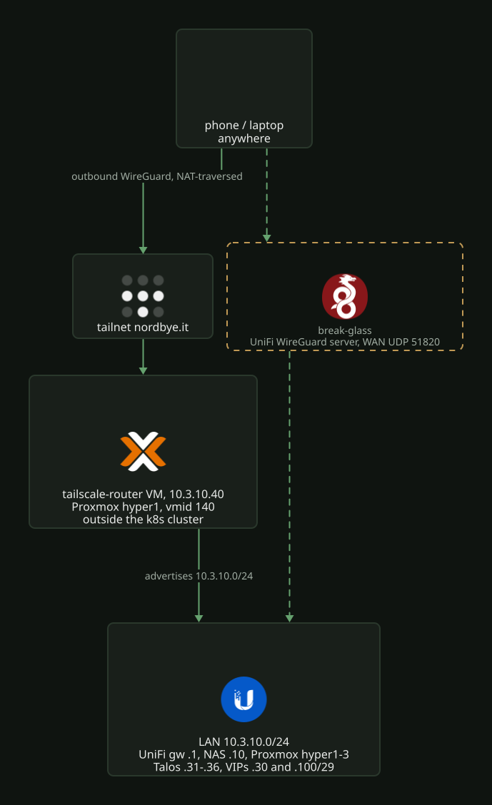

# Remote access: Tailscale, with WireGuard as break-glass

Remote access to the homelab runs over Tailscale. Nothing listens on the WAN
for it: every device makes outbound connections to the tailnet, and a small
subnet-router VM on Proxmox advertises the LAN. The UniFi gateway's built-in
WireGuard server is the break-glass path for when Proxmox itself is down. It is
the only inbound port, and it is used for nothing else.

The router is a VM outside the Kubernetes cluster so remote access keeps
working while the cluster is mid-upgrade or broken. It is a VM rather than an
LXC because Tailscale needs `/dev/net/tun`, which the bpg provider cannot pass
through to a container.

## What Terraform declares

`terraform/proxmox/hyper-cluster/tailscale/` owns the Tailscale side.

The router VM is vmid 140 on hyper1 at `10.3.10.40`, booted from the Debian 13
genericcloud image. Cloud-init installs Tailscale and joins with an auth key
minted in the same plan (`reusable = false`, 90 day expiry, pre-authorized,
tagged `tag:subnet-router`).

`tailscale_acl` owns the entire tailnet policy file: tag definitions, an
`autoApprovers` rule so the advertised route comes up approved with no console
click, the access grants, and the Tailscale SSH rule. Policy changes happen in
Terraform; a console edit is drift and gets overwritten on the next apply.

Split DNS sends `local.bigd.no` to the UniFi gateway (`10.3.10.1`) for tailnet
clients, so internal hostnames work remotely.

`terraform/unifi/network/remote-access.tf` owns the break-glass side: the
UniFi WireGuard server on UDP 51820, and the Cloudflare dynamic DNS records
(`ddns.bigd.no`, `ddns.nordbye.it`) that keep the WAN address reachable by name.

## Bootstrap that cannot be declared

The tailnet itself is created interactively at signup under the identity
`morten@nordbye.it`. Tailscale has no email accounts; the tailnet hangs off an
identity provider, so that provider's MFA is network security.

On a fresh tailnet, before the first `terraform apply`:

1. In the admin console policy file, add `tag:subnet-router` to `tagOwners`.
   The tag must exist before an OAuth client can be scoped to it.
2. Create an OAuth client (Settings, Trust credentials) with write scope on
   Auth Keys (`tag:subnet-router`), Policy File and DNS. Put its id and secret
   in the root's gitignored `terraform.tfvars`.
3. Import the policy, since the provider refuses to overwrite a non-default
   one: `terraform import tailscale_acl.tailnet acl`.
4. Set `proxmox_ssh_password` in `terraform.tfvars`. The cloud-init snippet
   upload goes over SSH, and the hyper nodes do not trust the laptop's key.

## Operations

- Rebuilding the VM: the join key is single-use and expires after 90 days, so
  replace it alongside the VM with
  `terraform apply -replace=tailscale_tailnet_key.router`. Tagged devices
  themselves never key-expire.
- First boot takes a few minutes (apt update, Tailscale install, then
  `tailscale up`). The machine then shows in the admin console as
  `tailscale-router` with its route already approved.
- The join key sits in the Terraform state and in the cloud-init snippet on
  Proxmox storage. It is single-use, tag-scoped and short-lived, and the state
  already holds more sensitive material (the Talos PKI).
- The cloud image and snippet live on the shared `nfs-vmstore`; the VM disk is
  on hyper1's `local-lvm`.
- Break-glass: keep a WireGuard profile installed on the phone and test it
  from cellular now and then.
- Tailnet lock is off, because every Terraform-created node would otherwise
  need a manual `tailscale lock sign` from a trusted device.
