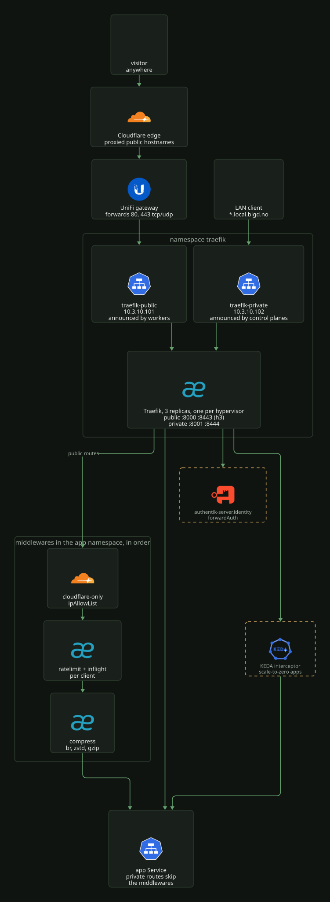

# Traefik

Traefik is the only ingress. It runs as three replicas in the `traefik` namespace, one per
hypervisor (required anti-affinity on `topology.kubernetes.io/zone`), from the Helm chart in
[`kustomization.yaml`](../../../k8s/talos/infra/traefik/kustomization.yaml) with
[`values.yaml`](../../../k8s/talos/infra/traefik/values.yaml). Routes are Gateway API
`HTTPRoute`s; the Kubernetes CRD provider is on for `Middleware` objects, with
`allowCrossNamespace: true`.

[](../../assets/diagrams/network-traefik.svg)

## Gateways

Two Gateways share the same pods and are told apart by entrypoint port. Each has its own
LoadBalancer Service with a fixed VIP from the Cilium pool (see [`README.md`](README.md)).

| Gateway | Service and VIP | Listener | Port (Service to pod) | TLS secret in `cert-manager` |
| --- | --- | --- | --- | --- |
| `traefik-gateway-public` | `traefik-public`, `10.3.10.101` | `web` | 80 to 8000, redirects to https | none |
| | | `websecure` | 443 to 8443, TCP and UDP | `bigd-no-tls`, `nordbye-it-tls`, `logeverylift-com-tls`, picked by SNI |
| `traefik-gateway-private` | `traefik-private`, `10.3.10.102` | `web` | 80 to 8001, redirects to https | none |
| | | `local-bigd-no` | 443 to 8444, hostname `*.local.bigd.no` | `local-bigd-no-tls` |

Files: [`gateway-public.yaml`](../../../k8s/talos/infra/traefik/gateway-public.yaml),
[`gateway-private.yaml`](../../../k8s/talos/infra/traefik/gateway-private.yaml),
[`service-public.yaml`](../../../k8s/talos/infra/traefik/service-public.yaml),
[`service-private.yaml`](../../../k8s/talos/infra/traefik/service-private.yaml). The chart's
own Service and Gateway are disabled. The certificates are in
[`certificates.md`](certificates.md).

The public Gateway carries the label `external-dns: public` and the target annotation
`ddns.bigd.no`, so external-dns publishes every `bigd.no` hostname routed through it (see
[`cloudflare.md`](cloudflare.md#bigdno)). The private Gateway gets no DNS from the cluster;
`local.bigd.no` names are UniFi records ([`dns.md`](dns.md)).

The two VIPs are announced from disjoint node sets, public from the workers and private
from the control planes ([`cilium.md`](cilium.md#l2-announcements-and-lb-ipam)).

The dashboard is at `traefik.local.bigd.no`
([`httproute-dashboard.yaml`](../../../k8s/talos/infra/traefik/httproute-dashboard.yaml)).

## HTTP/3

`websecure` serves HTTP/3 over UDP on the same port. It needs four pieces, and a missing
one makes h3 fail silently while HTTP/2 keeps working:

- `http3.advertisedPort: 443` in `values.yaml`. Traefik listens on 8443 and would
  otherwise advertise `Alt-Svc: h3=":8443"`, which is not reachable from outside.
- The `websecure-h3` UDP port on `traefik-public`.
- UDP 8443 in the Traefik
  [`ciliumnetworkpolicy.yaml`](../../../k8s/talos/infra/traefik/ciliumnetworkpolicy.yaml).
- The `443 tcp/udp` port forward to `10.3.10.101` on the UniFi gateway
  ([`unifi.md`](unifi.md)).

The private gateway serves TCP only.

## Tracing and metrics

Every request is traced (`sampleRate: 1.0`) and exported over OTLP gRPC to
`tempo.monitoring:4317`, service name `traefik`. Prometheus metrics with entrypoint, router
and service labels are on port 9100, scraped through the chart's ServiceMonitor. Access
logs are on. See [`../observability/README.md`](../observability/README.md).

## Middlewares

Middlewares are Traefik `Middleware` objects in the app's own namespace, attached to an
HTTPRoute rule as `ExtensionRef` filters. Traefik applies filters in the order listed, so
the allow list goes first and compression last.

| Middleware | Used by | What it does |
| --- | --- | --- |
| `<app>-cloudflare-only` | every proxied public route | `ipAllowList` of the Cloudflare ranges, so the origin only answers the edge |
| `<app>-ratelimit` | blog, portfolio | `rateLimit` token bucket per client (blog 25/s burst 100, portfolio 50/s burst 200) |
| `<app>-inflight` | blog, portfolio | `inFlightReq` concurrency cap per client (blog 30, portfolio 60) |
| `<app>-compress` | blog, blog-stage, portfolio, portfolio-stage, headroom-demo | `compress` with br, zstd, gzip on text types over 1 KiB |
| `<app>-authentik` | homepage, reelsmith admin route | `forwardAuth` to `authentik-server.identity` |

Templates: [`blog/httproute.yaml`](../../../k8s/talos/apps/blog/httproute.yaml) and the
`*-middleware.yaml` files beside it, and
[`homepage/httproute.yaml`](../../../k8s/talos/apps/homepage/httproute.yaml) for forward auth.

Rules that the files depend on:

- `ipAllowList` has no `ipStrategy`. It checks the TCP peer, which is a Cloudflare edge;
  X-Forwarded-For can be spoofed.
- `rateLimit` and `inFlightReq` key on `ipStrategy.depth: 1`, the rightmost
  X-Forwarded-For entry, which is the client Cloudflare saw. That entry is only kept
  because the entrypoints trust the Cloudflare ranges (`forwardedHeaders.trustedIPs`).
- `inFlightReq` must set `sourceCriterion` explicitly. Its default keys on the request
  host, which caps the whole site rather than each client.
- Each Traefik replica keeps its own bucket, so the effective limit is up to three times
  the configured value.
- A forward-auth route needs a separate `/outpost.goauthentik.io/` rule without the auth
  filter that points at `authentik-server` in `identity`, allowed by a ReferenceGrant in
  `identity` (for example
  [`referencegrant-homepage.yaml`](../../../k8s/talos/infra/authentik/referencegrant-homepage.yaml)).
- `forwardAuth.trustForwardHeader` stays `false` on public hosts.

`audiobookshelf.bigd.no` is the one public route without `cloudflare-only`: it is DNS-only
(see [`cloudflare.md`](cloudflare.md#origin-and-proxying)), so its clients connect directly.

## Cloudflare ranges

The Cloudflare IP ranges exist in fourteen places that must stay identical:
`trustedIPs` under `ports.web.forwardedHeaders` in `values.yaml` (reused by `websecure`
through the YAML anchor `&cloudflareIPs`), and the `sourceRange` of every
`cloudflare-only-middleware.yaml`. A range missing from a middleware returns 403 to
visitors served by that edge; a range missing from `trustedIPs` makes those visitors share
one rate-limit bucket.

List every copy:

```bash
git ls-files 'k8s/**/cloudflare-only-middleware.yaml'
grep -rln 'ranges mirror trustedIPs' k8s/
```

To update, fetch `https://www.cloudflare.com/ips-v4` and `https://www.cloudflare.com/ips-v6`,
edit the list under `trustedIPs: &cloudflareIPs` in `values.yaml`, then write the same list
into every middleware in the same PR. Check that each copy matches:

```bash
sed -n '/trustedIPs: &cloudflareIPs/,/expose:/p' k8s/talos/infra/traefik/values.yaml \
  | grep -oE '[0-9a-f:.]+/[0-9]+' > /tmp/cf-ranges
for f in $(git ls-files 'k8s/**/cloudflare-only-middleware.yaml'); do
  grep -oE '[0-9a-f:.]+/[0-9]+' "$f" | diff -q /tmp/cf-ranges - >/dev/null || echo "differs: $f"
done
```

No output means every copy matches. A new public app adds its own copy.

## Exposing an app

1. Pick the gateway. Internal apps use `traefik-gateway-private` with a
   `<name>.local.bigd.no` hostname, and need a UniFi DNS record ([`dns.md`](dns.md)).
   Public apps use `traefik-gateway-public` with a hostname under `bigd.no`, `nordbye.it`
   or `logeverylift.com`, the zones that have a certificate on `websecure`.
2. Write an `HTTPRoute` in the app's namespace with `parentRefs` to that Gateway in
   namespace `traefik`. [`verksted/httproute.yaml`](../../../k8s/talos/apps/verksted/httproute.yaml)
   is the private template.
3. For a public app, copy a `cloudflare-only-middleware.yaml` into the app, renamed
   `<app>-cloudflare-only`, and add it as the first filter. A `bigd.no` hostname also
   sets `external-dns.kubernetes.io/cloudflare-proxied: "true"` on the route;
   [`it-tools/httproute.yaml`](../../../k8s/talos/apps/it-tools/httproute.yaml) is the
   template. `nordbye.it` and `logeverylift.com` hostnames are Terraform records, see
   [`cloudflare.md`](cloudflare.md).
4. Add rate-limit, in-flight or compress middlewares as the site needs, in the order above.
5. Allow ingress from Traefik in the app's CiliumNetworkPolicy
   ([`cilium.md`](cilium.md#network-policies)).
6. An app that scales to zero routes to `keda-add-ons-http-interceptor-proxy` in `keda`
   instead of its own Service, and its namespace must be added to
   [`referencegrant.yaml`](../../../k8s/talos/infra/keda-http-add-on/referencegrant.yaml).

Check the route was accepted:

```bash
kubectl -n <ns> get httproute <name> -o jsonpath='{.status.parents[*].conditions}'
```
