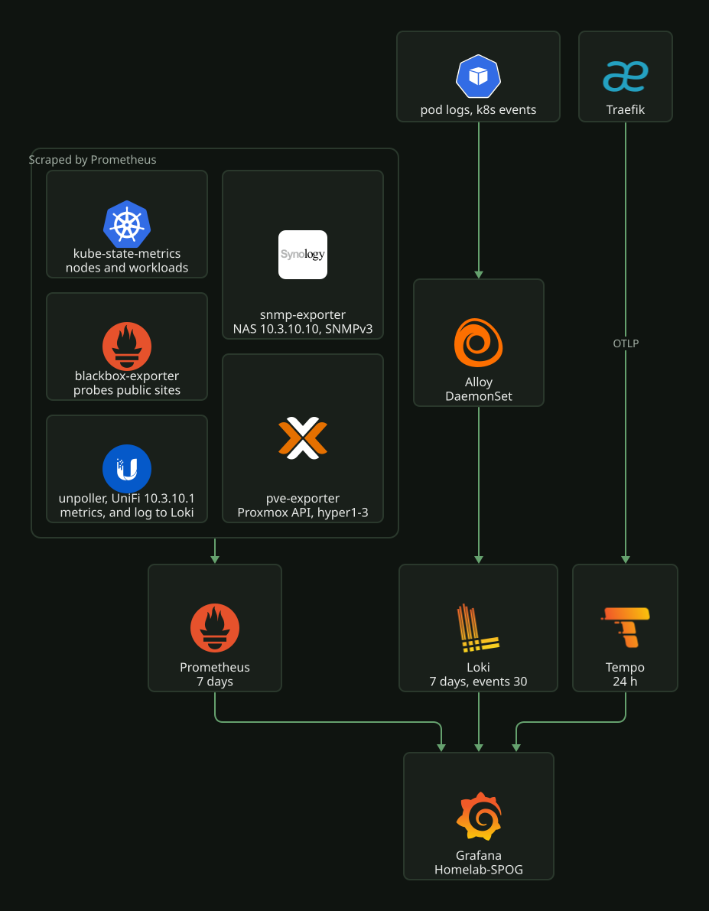
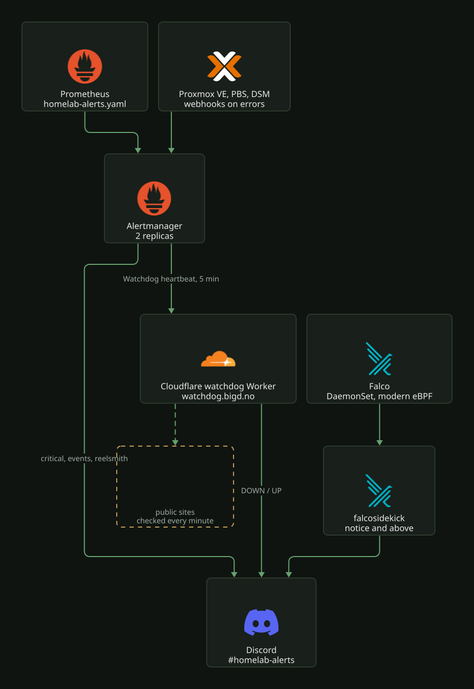

# Monitoring

## Where to look

| What | URL |
|---|---|
| Grafana, dashboard Homelab-SPOG | https://grafana.local.bigd.no/d/mns9wmn |
| Alertmanager | https://alertmanager.local.bigd.no |
| Prometheus | https://prometheus.local.bigd.no |
| Discord | `#homelab-alerts` |

SPOG rows, outside in: the network and hosts first, then the cluster platform, then the apps.
Every row starts collapsed.

| Row | Shows |
|---|---|
| Internet & network | internet up/down, availability, downtime and outages over the range, probe latency; UniFi WAN latency, session uptime, drops, gateway CPU, switch port traffic, errors and drops |
| Public sites | public site probes and response time, traffic share per site, then request rate, 5xx rate, p95 and status codes per site (one repeated set of panels over the hidden `site` variable) |
| Backups | age of the last etcd and dump jobs, VolSync sources behind schedule |
| Proxmox | host up/down, VMs running and stopped (templates excluded), host CPU, memory and CPU temperature, storage used per host (local, local-lvm) and shared (pbs, nfs-vmstore) |
| NAS (Synology) | system status, Volume 1 used and free, RAID status, unhealthy disks, temperature, eth0 traffic, disk temperatures |
| Nodes | per-node CPU, load, memory, disk I/O and space, network, Talos `/var` free space |
| Workloads | CPU and memory usage and limits per namespace, PVC inventory, warning event rate by reason |
| Ingress & DNS | Traefik request rate, 5xx rate, latency, top services; CoreDNS requests, response codes, cache hits, latency |
| Cilium | drops by reason, policy import, endpoint regeneration, Hubble policy drops and the dropped flows |
| Certificates | readiness, days to expiry per certificate, sync errors, ACME latency |
| GitOps & secrets | Argo CD sync and health, ESO sync status and secrets not ready, Reloader reloads |
| KEDA autoscaling | replica and scaler state, wake-from-zero, capacity and electricity reclaimed |
| Falco | instances, rule matches, event drops, CPU and memory per node |
| Media stack | service status, health issues, queues, free space, library, download client and indexers |

Kubernetes events and live logs are on the separate Homelab-Log-SPOG dashboard.

## Stack

Grafana reads Prometheus, Loki and Tempo as data sources.

| Component | Role | Retention | Defined in |
|---|---|---|---|
| Prometheus | metrics, alert rules | 7 days | `k8s/talos/infra/kube-prometheus-stack/values.yaml` |
| Alertmanager | routing to Discord, 2 replicas | 5 days of silences and notification state | `k8s/talos/infra/kube-prometheus-stack/values.yaml` |
| Loki | logs, single binary | 7 days, Kubernetes events 30 days | `k8s/talos/infra/loki/values.yaml` |
| Alloy | DaemonSet shipping pod logs and Kubernetes events to Loki | none | `k8s/talos/infra/loki/alloy-values.yaml` |
| Tempo | traces, pushed over OTLP by Traefik | 24 h | `k8s/talos/infra/tempo/values.yaml` |
| Falco | runtime security events, modern eBPF driver | none | `k8s/talos/infra/falco/values.yaml` |

## Alert path

Prometheus rules → Alertmanager → Discord. Routing (`k8s/talos/infra/kube-prometheus-stack/values.yaml`):

- `alertname=Watchdog` (always firing) → `heartbeat`: a POST to the Cloudflare watchdog
  Worker every 5 min.
- `severity=critical` → `discord`, with resolved messages.
- namespace `proxmox` or `synology` → `discord-event`: one-shot pushes from Proxmox, PBS and
  DSM, no resolved message (they expire, they do not resolve).
- namespace `reelsmith` → `discord` at every severity.
- everything else is dropped.

Falco does not go through Alertmanager: falcosidekick posts to Discord directly at priority
`notice` and above.

During an internet outage Discord is unreachable; Alertmanager retries and delivers once the
line is back.

The watchdog Worker (`terraform/cloudflare/watchdog`, served at `watchdog.bigd.no`) runs
on Cloudflare and posts to the same Discord channel directly, as `[WATCHDOG] DOWN` and
`[WATCHDOG] UP`:

- no heartbeat for 15 min: the cluster, Prometheus, Alertmanager or the home line is down;
- a public site failing three one-minute checks in a row, seen from the internet.

To test the heartbeat path without silencing other alerts, add an Alertmanager silence
on `alertname=Watchdog` for 25 minutes (`amtool silence add alertname=Watchdog
--duration=25m` in the alertmanager container): the Worker posts DOWN about 15 minutes
after the last heartbeat and UP within minutes of the silence expiring. The Worker's
state is in its KV namespace, keys `heartbeat` and `state:heartbeat`.

Operating notes for the Worker (heartbeat URL rotation, the site list) are in
[`../network/cloudflare.md`](../network/cloudflare.md#watchdog-worker).

## Sources

| Source | Scrapes | Auth | Defined in |
|---|---|---|---|
| kube-prometheus-stack | cluster, nodes, kube-state-metrics | none | `k8s/talos/infra/kube-prometheus-stack/` |
| blackbox-exporter, Probe `internet` | HTTPS to google.com/generate_204 and cloudflare.com/cdn-cgi/trace every 15 s | none | `k8s/talos/infra/blackbox-exporter/` |
| blackbox-exporter, Probe `public-sites` | nordbye.it, blog.nordbye.it, logeverylift.com, auth.bigd.no, hub.bigd.no through public DNS and Cloudflare, every 60 s | none | `k8s/talos/infra/blackbox-exporter/probe.yaml` |
| unpoller | UniFi gateway `https://10.3.10.1`, scraped every 30 s; the gateway's system log pushed to Loki every minute as `{application="unifi_system_log"}` | local UniFi user `unpoller`, Network View Only, other apps None, Bitwarden `unpoller-unifi-password` | `k8s/talos/infra/unpoller/` |
| snmp-exporter | NAS `10.3.10.10`, modules `if_mib` + `synology`, every 60 s | SNMPv3 `snmp-exporter`, SHA/AES, Bitwarden `synology-snmp-auth-password`, `synology-snmp-priv-password` | `k8s/talos/infra/snmp-exporter/` |
| pve-exporter | Proxmox API on hyper1-3 (`/pve`, hyper1 also cluster-wide) every 60 s | token of `prometheus@pve` (PVEAuditor), Bitwarden `proxmox-exporter-token` | `k8s/talos/infra/pve-exporter/`, identity in `terraform/proxmox/hyper-cluster/datacenter/access.tf` |
| node-exporter on the Proxmox hosts | hyper1-3 `:9100`, CPU temperatures (`node_hwmon_temp_celsius`) every 60 s | none | `ScrapeConfig` in `k8s/talos/infra/pve-exporter/`, installed by `terraform/proxmox/hyper-cluster/datacenter/sensors.tf` |
| VolSync metrics | ReplicationSource sync state | none | `k8s/talos/infra/volsync/` |
| exportarr, qbittorrent-exporter | media apps | app API keys | `k8s/talos/apps/arr-stack/` |
| Proxmox VE, PBS webhooks | push to Alertmanager on errors | none | `terraform/proxmox/hyper-cluster/datacenter`, `terraform/proxmox/pbs` |
| DSM webhook "Alertmanager" | push on Warning and above | none | DSM, see below |

## Alerts

Rules live in `k8s/talos/infra/kube-prometheus-stack/homelab-alerts.yaml`, except reelsmith's,
which live in `k8s/talos/apps/reelsmith/monitoring.yaml` and reach Discord at every severity.
Everywhere else only critical reaches Discord.

| Alert | Fires when | Severity |
|---|---|---|
| `InternetDown` | both internet probes fail for 1 min | critical |
| `PublicSiteDown` | a public site fails for 5 min while the internet is up | critical |
| `BackupJobStale` | etcd, a `*-db-backup` or a `*-backup-check` CronJob not successful for 26 h, or scheduled and never succeeded | critical |
| `RestoreTestFailed` | the monthly restore test did not pass, or has not passed for 32 days | critical |
| `VolSyncBackupStale` | a ReplicationSource out of sync for 6 h | critical |
| `NasDiskUnhealthy` | `diskStatus` or `diskHealthStatus` not 1 for 10 min | critical |
| `NasRaidDegraded` | `raidStatus` not 1 for 10 min | critical |
| `NasVolumeAlmostFull` | Volume 1 above 90 % for 1 h | critical |
| `NasMetricsDown` | SNMP scrape failing for 30 min | critical |
| `ProxmoxHostDown` | a Proxmox host offline for 5 min | critical |
| `ProxmoxStorageAlmostFull` | a Proxmox storage above 85 % for 30 min | critical |
| `ProxmoxMetricsDown` | Proxmox exporter scrape failing for 30 min | critical |
| `DeploymentUnavailable`, `PodCrashLooping` | a workload down | critical |
| `ArrQueueStuck`, `MediaRootFolderLow`, `ArrAppUnreachable`, `MediaExporterDown`, `QbittorrentDisconnected` | media stack | critical |
| `CertificateExpiringSoon` | a cert-manager certificate within 7 days of expiry | critical |
| `ContainerRestartingFrequently`, `ContainerOOMKilled`, `ArgoCDAppDegraded`, `ArgoCDAppSyncStuck`, `ExternalSecretNotReady`, `KubeHpaMaxedOut` | platform | warning (not sent) |
| `SynologyNotification` | DSM pushed a Warning or Critical event | critical, `discord-event` |
| `ProxmoxNotification` | Proxmox or PBS pushed an error | critical, `discord-event` |
| `Reelsmith*` | the reelsmith gateway stalls, its token expires, a post or backup goes stale | critical and warning, all sent |

## Falco

Falco runs as a DaemonSet on all six nodes with the `modern_ebpf` driver, the only one
that works on Talos since it needs no kernel headers
([`values.yaml`](../../../k8s/talos/infra/falco/values.yaml), chart `falco` 9.1.0 in
[`kustomization.yaml`](../../../k8s/talos/infra/falco/kustomization.yaml)). The only event
source is syscalls; no plugins are loaded, so there is no Kubernetes audit log source.

Rules come from two places:

- the upstream stable ruleset, `falco-rules:5`, which falcoctl pulls from ghcr.io in an
  init container and a sidecar re-checks every 168 h (chart defaults). Falco does not start
  without it, which is why its CiliumNetworkPolicy allows egress to the world on 443;
- `customRules.tuning.yaml` in `values.yaml`, rendered into a ConfigMap. Reloader restarts
  the DaemonSet when it changes.

Events go to falcosidekick (two replicas), which posts to Discord at priority `notice` and
above. The webhook URL comes from the ExternalSecret `falco-falcosidekick-discord`
([`falcosidekick-discord-secret.yaml`](../../../k8s/talos/infra/falco/falcosidekick-discord-secret.yaml)),
and a kustomize patch puts the Reloader annotation on the falcosidekick Deployment so a new
URL is picked up. The web UI is off. Falco emits its own metrics on a 15 min stats
interval and exposes them to Prometheus through a ServiceMonitor.

### Writing an exemption

Tune through the hooks the upstream rules already consume, never by copying and editing an
upstream rule, so a ruleset update keeps the change:

- a macro the rule references (`known_drop_and_execute_activities`,
  `user_known_stand_streams_redirect_activities`, `allowed_clear_log_files`), overridden
  with `condition: replace`;
- a list the rule references (`known_drop_and_execute_containers`,
  `read_sensitive_file_images`), extended with `items: append`;
- the rule itself with `condition: append` and an `and not (...)` clause, when the only
  hook is a list matched on something too broad, such as a bare process name.

Scope every exemption to the process, image and path that cause it, so the same behaviour
elsewhere still alerts. `replace` on a macro drops whatever upstream put in it, so the new
condition has to carry the full intent.

Some containers show up as a generic upstream image. The verksted dind sidecar is seen as
`docker.io/library/docker`, so its exemptions go through the `verksted_dind` macro, which
also pins `k8s.ns.name=verksted`. An exemption on that image without the namespace would
exempt every `docker` container in the cluster.

### Expected noise

The current exemptions cover:

| Signal | Exempted for |
|---|---|
| drop and execute | the Cilium CNI plugin from `/opt/cni/bin`; the verksted image |
| symlink over sensitive files | links created under `/tmp/vk-repos-*` (verksted test suites inside dind, where Falco has no container metadata) |
| stdio redirected to a socket | `kubelet`; `authentik` in the Authentik server image |
| read of a sensitive file | the verksted image (`systemd-sysusers` reading `/etc/shadow` on `apt install`) |
| clear log files | `containerd` in the verksted dind sidecar, under its own snapshot root only |
| packet socket in a container | `cilium-agent` in the Cilium image; `dockerd` in the verksted dind sidecar |

verksted is exempted at the image level because its sessions run arbitrary code as root;
the rules that watch the container boundary (escape, kernel module load, `release_agent`,
debugfs) stay armed for it. The verksted namespace runs a privileged dind container; the
comment in its [`namespace.yaml`](../../../k8s/talos/apps/verksted/namespace.yaml) says
Falco will flag it, and no exemption targets it. See
[`../../apps/verksted/README.md`](../../apps/verksted/README.md).

## Configured outside Git

| Where | Setting |
|---|---|
| DSM Terminal & SNMP | SNMP on, v1/v2c off, SNMPv3 user `snmp-exporter`, SHA, privacy AES |
| DSM Notification > Webhooks | Custom "Alertmanager", rule Warning, POST `https://alertmanager.local.bigd.no/api/v2/alerts`, `Content-Type: application/json`, body `[{"labels":{"alertname":"SynologyNotification","severity":"critical","namespace":"synology","node":"nas"},"annotations":{"summary":"@@TEXT@@",...}}]` |
| DSM Notification > Email | Synology Account, rule All |
| UniFi Admins & Users | local user `unpoller`, restricted to local access, custom role: Network View Only, everything else None |
| DSM Shared Folder `shared-data` | quota 31 TiB (NasVolumeAlmostFull watches the volume, not share quotas) |

## Constraints

- CoreDNS forwards to the node resolver, which is the gateway `10.3.10.1`, so trouble on the
  gateway or ISP DNS also breaks in-cluster name resolution for external names.
  This is deliberate: a public fallback would answer `local.bigd.no` with NXDOMAIN and skip the
  gateway's filtering, and CoreDNS spreads queries across upstreams unless told otherwise.
